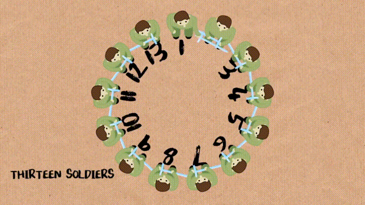

# Math

## Greatest Common Divisor(GCD)

Greatest common divisor(GCD) of two positive integers is the largest positive integer that divides both numbers without remainder. It is useful for reducing fractions to be in its lowest terms.

```C++
int gcd(int x, inty) { return y ? gcd(y, x % y) : x; }
```

## Least Common Multiple(LCM)

Least common multiple(LCM) of two integer is the smallest integer that is a multiple of both numbers.

```C++
int lcm(int x, int y) { return x / gcd(x, y) * y; }
```

## Josephus Problem



People are standing in a circle wating to be executed. Counting begins at a special point in the circle and proceeds around the circle in a specified direction. After a specified number of people are skipped, the next person is executed. The procedure is repeated with the remaining people, starting with the next person, going in the same direction and skipping the same number of people, until only one person remains, and is freed.

We define that:

- `f(n, m)` returns the remaining people indexed from `0` in `n` people and skips each `m` people.
- if we know `f(n - 1, m) = x`, then at the `n` trip we start from index `x + 1` and skip `m` people and then return the answer: `f(n - 1, m) + m`. Now that people are in a circle, we can avoid overflow by `f(n, m) = (f(n - 1, m) + m) % n`.
- As for the base, if `n == 1`, result is `0`.

```C++
int josephus(int n, int m) {
  return n == 1 ? 0 : (f(n - 1, m) + m) % n;
}
```

## Probability

### Conditional Probability

The conditional probability of an event $A$, given an event $B$ with $P(B) > 0$, is defined by:

$$
P(A|B) = \frac{P(A \cap B)} {P(B)}
$$

$$
P(A \cap B) = P(B) * P(A|B)
$$

### Multiplication Rule

Assuming that all of the conditioning events have positive probability, we have:

$$
P(\cap^{n}_{i = 1} A_{i}) = P(A_1) P(A_2 | A_1) P(A_3 | A_1 \cap A_2) \cdots P(A_n | \cap^{n - 1}_{i = 1} A_{i})
$$

### Total Probability Theorem

Let $A_1, \cdots, A_n$ be disjoint events that form a partition of the sample space (each possible outcome is included in one and only one of the events $A_1, \cdots, A_n$) and assume that $P(A_i) > 0$, for all $i = 1, \cdots, n$. Then, for any event B, we have:

$$
\begin{align}
P(B) &= P(A_1 \cap B) + \cdots + P(A_n \cap B) \\
     &= P(A_1)P(B|A_1) + \cdots + P(A_n)P(B|A_n) \\
\end{align}
$$

### Bayes' Rule

Let $A_1, A_2, \cdots, A_n$ be disjoint events that form a partition of the sample space, and assume that $P(A_i) > 0$, for all $i$. Then, for any event B such that $P(B) > 0$, we have:

$$
\begin{align}
P(A_i | B) &= \frac{P(A_i) P(B | A_i)} {P(B)} \\
           &= \frac{P(A_i) P(B | A_i)} {P(A_1)P(B|A_1) + \cdots + P(A_n)P(B|A_n)}
\end{align}
$$

### Counting

The `permutation` of n objects is:

$$
n!
$$

#### K-Permutations

If we want to count the number of different ways that we can pick k out of n objects and arrange them in a sequence, the number of posibble sequences is called `k-permutations`:

$$
\begin{align}
n(n - 1) \cdots (n - k + 1) &= \frac{n(n - 1)\cdots(n - k + 1)(n - k)\cdots 2 \times 1} {(n - k) \cdots 2 \times 1} \\
                            &= \frac{n!}{(n - k)!} \\
\end{align}
$$

#### K-Combinations

A combination is a choice of k elements out of an n-element set without regard to order. Combination has no ordering of the selected elements.

$$
\binom{n}{k} = \frac{n!} {k! (n - k)!}
$$

#### Partition

We have n distinct objects and we are given nonnegative integers $n_1, n_2, \cdots, n_r$, whose sum is equal to n. The n items are to be divided into r disjoint groups, with the ith group containing exactly $n_i$ items. Partitions of n objects into r groups with ith group having $n_i$ objects is called `multinomial coefficient`:

$$
\begin{align}
\binom{n}{n_1, n_2, \cdots, n_r} &= \binom{n}{n_1} \binom{n - n_1}{n_2} \binom{n - n_1 - n_2}{n_3} \cdots \binom{n - n_1 - \cdots - n_{r - 1}}{n_r} \\
&= \frac{n!}{n_1!(n - n_1)!} \frac{(n - n_1)!}{n_2!(n - n_1 - n_2)!} \cdots \frac{(n - n_1 - \cdots - n_{r - 1})!}{(n - n_1 - \cdots - n_{r - 1} - n_r)!n_r!} \\
&= \frac{n!}{n_1!n_2!\cdots n_r!} \\
\end{align}
$$
