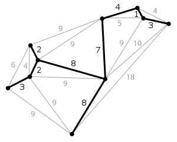
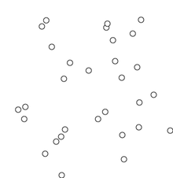
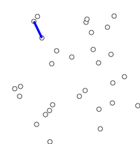
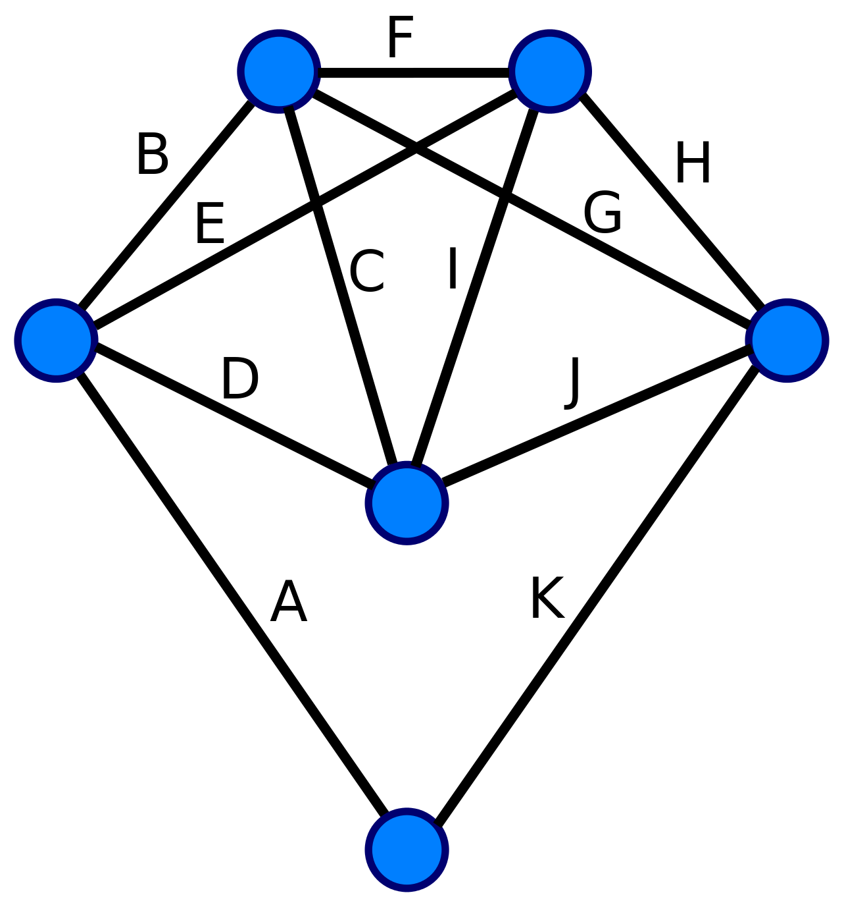

# Graph

A `Graph` consists of:

- `node`s(vertices) and
- `edge`s which connecting these `node`s.

Graphs are mathematical structures uesed to model pairwise relations between objects. 


A distinction is made between:

- `undirected graph`: where edges link two nodes symmetrically;
- `directed graph`: where edges link two nodes asymmetrically.

A `Graph` can be defined as:
```C++
template <typename T>
struct Vertex {
  T id{};
  double cost{0.};
};

template <typename T>
struct Edge {
  Vertex<T>* from{nullptr};
  Vertex<T>* to{nullptr};
  double cost{0.};
};

template <typename T>
class Graph {
 public:
  void AddVertex(const T& v, double cost = 0.) {
    vs[v] = Vertex<T>{v, cost};
  }

  void AddEdge(const T& from, const T& to, double cost = 0.) {
    if (!vs.count(from)) AddVertex(from);
    if (!vs.count(to)) AddVertex(to);
    if (!es.count(from)) es[from] = {};
    es[from].push_back({&vs[from], &vs[to], cost});
  }

  const vector<Edge<T>>& GetEdges(const T& v) {
    return es[v];
  }

  const size_t GetVertexSize() const {
    return vs.size();
  }

 private:
  unordered_map<T, Vertex<T>> vs{};
  unordered_map<T, vector<Edge<T>>> es{};
};

```

## Disjoint-Set

A `disjoint-set`, also called `union-find` or `merge-find` set, is a data structure that stores a collection of disjoint(non-overlapping) setting. Equivalently, it stores a partition of a set into disjoint subsets. It provides operations for adding new sets, merging sets and finding a representative member of a set.

```C++
class UnionFind {
 public:
  Union(int n) : size(n - 1, 1), cnt{n} {
    for (int i = 0; i < n; ++i) parent.push_back(i);
  }

 public:
  int find(int x) {
    if (parent[x] != x) parent[x] = find(parent[x]);
    return parent[x];
  }

  bool union(int x, int y) {
    int xx = find(x);
    int yy = find(y);
    if (xx == yy) return false;
    if (size[xx] > size[yy]) swap(xx, yy);
    parent[xx] = yy;
    size[yy] += size[xx];
    cnt--;
    return true;
  }

  int count() { return cnt; }

  int connect(int x, int y) { return find(x) == find(y); }

 private:
  vector<int> parent{};
  vector<int> size{};
  int cnt{0};
};
```

## Breadth-first Search(BFS)
BFS is an algorithm for traversing or searching tree or graph data structures. It starts at the tree root(or some arbitrary node of a graph, sometimes referred as a `search key`), and explores all of the neighbor nodes at the present depth prior to moving on to the nodes at the next depth level.


```C++
void bfs(Graph& graph, int start) {
  deque<int> d{start};
  unordered_set<int> visited{start};
  while (!d.empty()) {
    int node = d.front();
    d.pop_front();
    for (auto next : graph[node]) {
      if (visited.count(next)) continue;
      visited.insert(next);
      d.push_back(next);
    }
  }
}
```

## Depth-first Search(DFS)
DFS is an algorithm for traversing or searching tree or graph data structure. The algorithm starts at the root node(selecting some arbitrary node as the root node in the case of a graph) and explores as far as possible along each branch before backtracking.


```C++
void dfs(Graph& graph, unordered_set<int>& visited, int root) {
  if (visited.count(root)) return;
  for (auto next : graph[root]) {
    dfs(graph, visited, next);
  }
}
```

## Shortest Path(SP)
In graph theory, the `shortest path problem` is the problem of finding a path between two nodes in a graph such that the sum of the weights of its constituent edges is minimized. The mainly used algorihtms are:

- Floyd
- Bellman-Ford
- Dijkstra

| Floyd | Bellman-Ford | Dijkstra |
| --- | --- | --- |
| Multiple-source Shortest Path | Singole-source Shortest Path | Single-source Shortest Path |
| Not negtive cycle graph | any graph | Not negtive edge graph |
| $O(N^3)$ | $O(NM)$ | $O(MlogM)$ |

### Floyd
Floyd algorithm compares all possible paths through the graph between each pair of vertices.
```C++
vector<vector<int>> floyd(Graph& graph, int node) {
  auto m = graph.size();
  vector distance(m + 1, vector<int>(m + 1, INT_MAX));
  for (int i = 1; i <= n; ++i) distance[i][i] = 0;
  for (int k = 1; k <= n; ++k) {
    for (int i = 1; i <= n; ++i) {
      for (int j = 1; j <= n; ++j) {
        distance[i][j] = min(distance[i][j], distance[i][k] + graph[k][j]);
      }
    }
  }

  return distance;  // RVO
}
```

### Bellman-Ford
Bellman-Ford is an algorithm that computes shortest paths from a single source node to all of the other nodes in a weighted digraph. It is capable of handling graphs in which some of the edge weights are negtive numbers.
```C++
int bellman_ford(Graph& graph, int src, int tar) {
  queue<int> q{src};
  unordered_set<int> visited{src};
  vector distance(graph.size() + 1, INT_MAX);
  distance[src] = 0;

  auto relax = [&](auto src, auto tar) -> bool {
    if (distance[src] + graph[src][tar] > distance[tar]) return false;
    distance[tar] = distance[src] + graph[src][tar];
    return true;
  };

  while (!q.empty()) {
    int node = q.top();
    q.pop();
    visited.erase(node);
    for (auto next : graph[node]) {
      if (relax(node, next) && !visited.count(next)) {
        visited.insert(next);
        q.push(next);
      }
    }
  }

  return distance[tar];
}
```

### Dijkstra
Dijkstra is an algorithm that computes shortest paths from a single source node to all of the other nodes in a weighted digraph. It is not able to handle graphs in which some of the edge weights are negtive numbers.


```C++
int dijkstra(Graph& graph, int src, int tar) {
  vector distance(graph.size() + 1, INT_MAX);
  distance[src] = 0;

  auto gt = [](auto& a, auto& b) { return a.second > b.second; };
  usint PII = pair<int, int>;
  priority_queue<PII, vector<PII>, decltype(gt)> q(gt);

  auto relax = [&](auto src, auto tar) -> bool {
    if (distance[src] + graph[src][tar] > distance[tar]) return false;
    distance[tar] = distance[src] + graph[src][tar];
    return true;
  };

  while (!q.empty()) {
    auto [node, val] = q.top();
    q.pop();

    for (auto next : graph[node]) {
      if (relax(node, next)) q.emplace_back(next, distance[next]);
    }
  }

  return distance[tar];
}
```

## K Shortest Path(KSP)
The `KSP` problem is a generalization of the `SP` problem in a given network. It asks not only about a shortest path but also about next $k - 1$ shortest path (which may be longer than the shortest path). A variant of the problem is the loopless k shortest paths.

### A*

```C++
double a_star(Graph<int> graph, vector<double>& h, int src,
                           int tar, int k) {
  int m = graph.GetVertexSize();
  vector<double> g(m, 1e7);
  g[src] = 0;

  auto gt = [](auto& a, auto& b) -> bool { return a.second > b.second; };
  using PID = pair<int, double>;
  priority_queue<PID, vector<PID>, decltype(gt)> q(gt);
  q.emplace(src, h[src]);

  unordered_map<int, int> parent{};
  int cnt{0};

  while (!q.empty()) {
    auto [node, f] = q.top();
    q.pop();

    if (node == tar) cnt++;
    if (cnt == k) return g[node];

    for (auto& [from, to, cost]: graph.GetEdges(node)) {
      g[to->id] = g[node] + cost;
      q.emplace(to, g[to->id] + h[to->id]);
    }
  }

  return -1;
}
```

## Topological Sorting
A topological sort of a directed graph is a linear ordering of its nodes such that for every directed edge $(u, v)$, $u$ comes before $v$ in the ordering.

### BFS
```C++
vector<int> res{};
bool topo_sort(Graph& graph, vector<int>& in_degree) {
  queue<int> q{};
  for (int i = 0; i < in_degree.size(); ++i) {
    if (in_degree[i] == 0) q.push(i);
  }

  while (!q.empty()) {
    int node = q.top();
    q.pop();
    res.push(node);
    for (auto next : graph[node]) {
      in_degree[next]--;
      if (in_degree[next] == 0) q.push(next);
    }
  }

  return res.size() == in_degree.size();
}
```

### DFS
```C++
vector<int> color{};  // 0: white; 1: gray; 2: black
vector<int> topo{};

bool dfs(Graph& graph, int node) {
  color[node] = 1;
  for (auto next : graph[node]) {
    if (color[next] == 1) return false;
    if (color[next] == 0 && !dfs(graph, next)) return false;
  }
  color[node] = 2;
  topo.push_back(node);
  return true;
}

bool topo_sort(Graph& graph) {
  color.resize(graph.size(), 0);
  topo.clear();

  for (int i = 0; i < graph.size(); ++i) {
    if (color[i] == 0 && !dfs(graph, i)) return false;
  }
  reverse(topo.begin(), topo.end());
  return true;
}
```

## Minimum Spanning Tree(MST)
A minimum spanning tree(MST) is a subset of the edges of a connected, edge-weighted undirected graph that connects all the nodes together, without any cycles and with the minimum possible total edge weight. That is, it is a spanning tree whose sum of the edge weights is as small as possible. More generallly, any edge-weighted undirected graph(not neccessarily connected) has a minimum spanning forest, which is a union of the minimum spanning trees for its connected components.


### Kruskal
Kruscal's algorithm finds a minimum spanning forest of an undirected edge-weighted graph. If the graph is connected, it finds a minimum spanning tree. For a disconnected graph, a minimum spanning forest is composed of a minimum spanning tree for each connected component. It is a greedy algorithm in graph theory as in each step it adds the next lowest-weight edge that will not form a cycle to the minimum spanning forest.


```C++
class UnionFind {
 public:
  Union(int n) : size(n - 1, 1), cnt{n} {
    for (int i = 0; i < n; ++i) parent.push_back(i);
  }

 public:
  int find(int x) {
    if (parent[x] != x) parent[x] = find(parent[x]);
    return parent[x];
  }

  bool unite(int x, int y) {
    int xx = find(x);
    int yy = find(y);
    if (xx == yy) return false;
    if (size[xx] > size[yy]) swap(xx, yy);
    parent[xx] = yy;
    size[yy] += size[xx];
    cnt--;
    return true;
  }

  int count() const {
    return cnt;
  }

 private:
  vector<int> parent{};
  vector<int> size{};
  int cnt{0};
};

struct Edge{
  int from{0};
  int to{0};
  int cost{0};
};

// n: node_num
int kruskal(vector<Edge>& edges, int n) {
  UnionFind uf{n};
  sort(edges.begin(), edges.end(), [](auto& a, auto& b) {
    return a.cost < b.cost;
  });

  int res{0};
  for (auto [from, to, cost] : edges) {
    if (uf.unite(from, to)) res += cost;
  }

  return uf.count() == 1 ? res : -1;
}

```

### Prim
Prim algorithm is a greedy algorithm that finds a minimum spanning tree for a weighted undirected graph. This means it finds a subset of the edges that forms a tree that includes every nodes, where the total weight of all the edges in the tree is minimized. The algorithm operates by building this tree one node at a time, from an arbitrary starting node, at each step adding the cheapest possible connection from the tree to another node.


## Strongly Connected Components(SCC)
### Tarjan
### Kosaraju

## Euler Graph



An `Eulerian trail` or `Euler walk` in an *undirected graph* is a path that uses each edge exactly once. If such a path exists, the graph is called `traversable` or `semi-eulerian`.

An `Eulerian cycle`, `Eulerian circuit` or `Euler tour` in an undirected graph is a cycle that uses each edge exactly once. 

A graph that has an Eulerian trail but not an Eulerian circuit is called `semi-Eulerian`.

### Properties

- An undirected graph has Eulerian cycle if and only if every vertex has even degree, and all of its vertices with nonzero degree belong to a single connected component.
- An undirected graph can be decomposed into edge-disjoint cycles if and only if all of its vertices have even degree. 
- An undirected graph has an Eulerian cycle if and only if exactly zero or two vertices have odd degree.
- A directed graph has an Eulerian cycle if and only if every vertex has equal in degree and out degree, and all of its vertices with nonzero degree belong to a single strongly connected component.
- A directed graph has an Eulerian trail if and only if at most one vertex has (out-degree) − (in-degree) = 1, at most one vertex has (in-degree) − (out-degree) = 1, every other vertex has equal in-degree and out-degree, and all of its vertices with nonzero degree belong to a single connected component of the underlying undirected graph.

### Fleury

Fleury's algorithm is an elegant but inefficient algorithm, we don't use it in general.

### Hierholzer

Hierholzer's algorithm provides a different method for finding Euler cycles that is more efficient than Fleury's algorithm:

- Choose any starting vertex v, and follow a trail of edges from that vertex until returning to v. It is not possible to get stuck at any vertex other than v, because the even degree of all vertices ensures that, when the trail enters another vertex w there must be an unused edge leaving w. The tour formed in this way is a closed tour, but may not cover all the vertices and edges of the initial graph.
- As long as there exists a vertex u that belongs to the current tour but that has adjacent edges not part of the tour, start another trail from u, following unused edges until returning to u, and join the tour formed in this way to the previous tour.
- Since we assume the original graph is connected, repeating the previous step will exhaust all edges of the graph.

```C++
void Hierholzer(Graph& graph, Node node) {
  while (!graph[node].empty()) {
    auto next = graph[node].back();
    graph[node].pop_back();
    Hierholzer(graph, next);
  }
}
```

### Problems

- [Reconstruct Itinerary](https://leetcode-cn.com/problems/reconstruct-itinerary/)
- [Cracking the Safe](https://leetcode-cn.com/problems/cracking-the-safe/)
- [Valid Arrangement of Pairs](https://leetcode-cn.com/problems/valid-arrangement-of-pairs/)

## Reference
- [10 Graph Algorithms Visually Explained](https://towardsdatascience.com/10-graph-algorithms-visually-explained-e57faa1336f3)
- [OI WIKI/Graph](https://oi-wiki.org/graph/)
