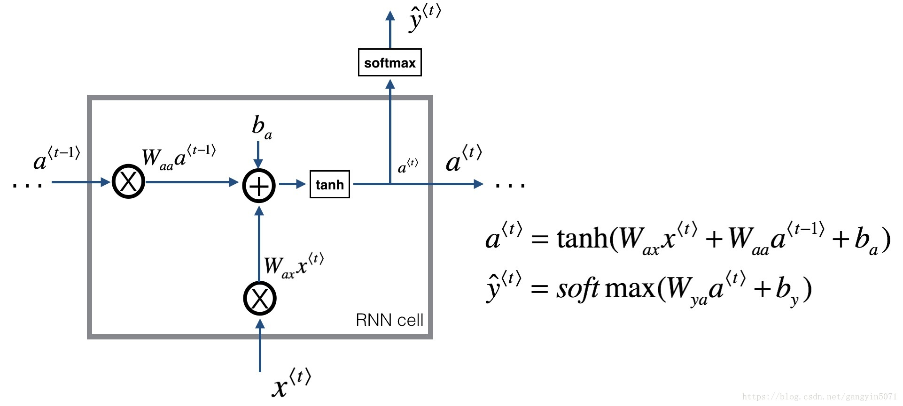
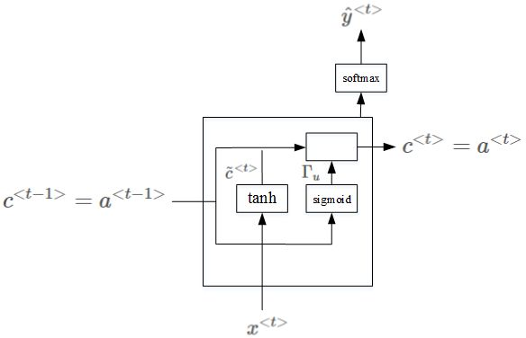
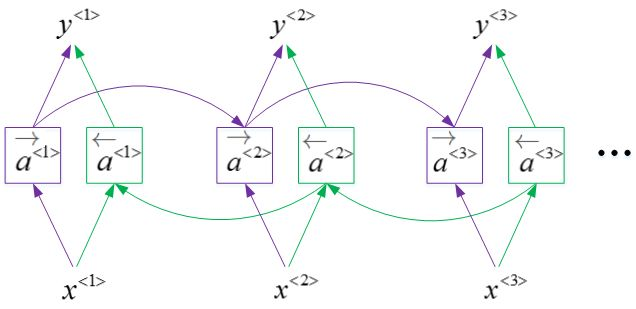
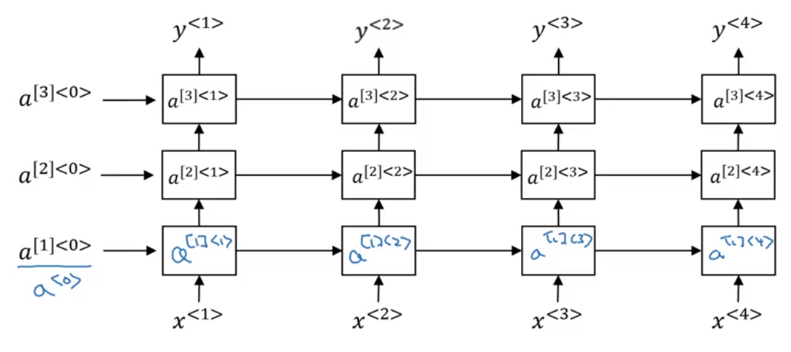

# Sequence models

## Recurrent neural networks
This type of model has been proven to perform extremely well on temporal data. It has several variants including LSTM, GRU and Bidirectional RNN.

### Why sequence models
Sequence models like RNN and LSTMs have greatly transformed learning on sequences in the past few years. Here are some sequence data examples in applications:

- Speech recognition(sequence to sequence):
    - X: wave sequence
    - Y: text sequence
- Music generation(one to sequence):
    - X: nothing or an integar
    - Y: wave sequence
- Sentiment classification(sequence to sequence):
    - X: text sequence
    - Y: integar rating from one to five
- DNA sequence analysis(sequence to sequence):
    - X: DNA sequence
    - Y: DNA labels
- Machine translation(sequence to sequence):
    - X: text sequence(in one language)
    - Y: text sequence(in another language)
- Video activity recognition(sequence to one):
    - X: video frames
    - Y: label(activity)
- Name entity recognition(sequence to sequence):
    - X: text sequence
    - Y: label sequence

All these problems with different input and output(sequence or not) can be addressed as supervised learning with labeled data X/Y as the training set.

### Notation
We now discuss the notation we used in this course.

We name entity recognition:

- X: "Harry Potter and Hermoine Granger invented a new spell."
- Y:  1     1      0   1        1       0        0 0   0

Both elements have a shape of $(9, 1)$. $1$ means it's a name and $0$ means it's not a name.

We will index the first element of $x$ by $x^{<1>}$, the second $x^{<2>}$ and so on:

$$
x^{<1>}, x^{<2>}, \cdots, x^{<n>}
$$

Similarly, we will index the first element of $y$ by $y^{<1>}$ and the second $y^{<2>}$ and so on:

$$
y^{<1>}, y^{<2>}, \cdots, y^{<n>}
$$

We use:

- $T_x$ to represent the size of input sequence;
- $T_y$ to represent the size of output sequence;
- $x^{(i)<t>}$ is the $t$th element of the sequence of input vector $i$;
- $y^{(i)<t>}$ is the $t$th element in the output sequence of $i$th training exmaple;
- $T_x^{(i)}$ is the sequence length for training example $i$, it can be different across the examples;
- $T_y^{(i)}$ is the length for output sequence in the $i$th training example.

One of the challenges of natural language processing(NLP) is how can we represent a word.

We need a `vocabulary` list that contains all the words in our target sets, for example:

$$
\begin{bmatrix}
a \\\\ \vdots \\\\ And \\\\ \vdots \\\\ Harry \\\\ \vdots \\\\ Potter \\\\ \vdots \\\\ Zulu
\end{bmatrix}
$$

Each word will have a unique index that it can be represented with, and the sorting here is in alphabetical order.
vocabulary sizes in modern applications are from $30000$ to $50000$, $100000$ is not uncommon, some of the bigger companies use even a million.

And then you create a `one-hot` encoding sequence for each word in your dataset given the vocabulary you have created.

$$
\begin{bmatrix}
0 \\\\ \vdots \\\\ 0 \\\\ \vdots \\\\ 1 \\\\ \vdots \\\\ 0 \\\\ \vdots \\\\ 0
\end{bmatrix}
$$

While converting, if a word is not in your dictionary, you can add a token in the vocabulary with name `<UNK>` wich stands for unknown text and use its index for your `one-hot` vector.

## Recurrent neural network model

Why not using a standard network for sequence tasks? There are two problems:

1. inputs and outputs can be different lengths in different example.
2. this doesn't share features learned across different positions of text/sequence.

Recurrent neural network doesn't have either of the two mentioned problems.

Let's build a `RNN` to solve the `name entity recognition` task:

In this problem, $T_x = T_y$. In other problems they may be not equal.

$a^{<0>}$ is usually initialized with zeros, but some other problems may initialize it randomly.

There are three weight matrices here with shape:

- $W_{ax}$: (NumberOfHiddenNeurons, $n_x$);
- $W_{aa}$: (NumberOfHiddenNeurons, NumberOfHiddenNeurons)
- $W_{ya}$: ($n_y$, NumberOfHiddenNeurons)

The weight matrix $W_{aa}$ is the memory that RNN is trying to maintain from previous layers.

A lot of papers and books write the same architecture in right figure way.

The limitation fo the discussed architecture is that it can not learn from elements later in the sequence.

The forward propagation is as follows:

$$
a^{<0>} = \vec{0}
$$

$$
a^{<1>} = g_1(w_{aa}a^{<0>} + w_{ax}x^{<1>} + b_a) \gets tanh | Relu
$$

$$
y^{<1>} = g_2(w_{ya}a^{<1>} + b_y) \gets sigmoid
$$

$$
a^{<t>} = g(w_{aa}a^{<t-1>} + w_{ax}x^{<t>} + b_a)
$$

$$
y^{<t>} = g_2(w_{ya}a^{<t>} + b_y)
$$

where:

- The activation function of $a$ is usually $tanh$ or $ReLU$;
- The activation function for $y$ is depending on your task and choosing $sigmoid$ or $softmax$.

Inorder to help us develop complex RNN architecture, the last equations needs to be simplified a lot:
Simplify:

$$
a^{<t>} = g(w_{aa}a^{<t-1\>} + w_{ax}x^{<t\>} + b_a)
$$

to:

$$
a^{<t>} = g(w_{a}[a^{<t-1\>}, x^{<t>}]^T + b_a)
$$

where

$$
w_a = \begin{bmatrix} w_{aa}, w_{ax}\end{bmatrix}
$$

In the equation,

- $w_a$ is $w_{aa}$ and $w_{ax}$ stacked horizontally;
- $[a^{<t-1>}, x^{<t>}]^T$ is $a^{<t-1>}$ and $x^{<t>}$ stacked vertically;
- the shape of $w_a$ is $(NumberOfHiddenNeurons, NumberOfHiddenNeurons + n_x)$;
- the shape of $[a^{<t-1>}, x^{<t>}]^T$ is $(NumberOfHiddenNeurons + n_x, NumberOfHiddenNeurons)$.

Following is the architecture for a single cell:

## Backpropagation through time
Usually deep learning frameworks do backpropagation automatically for you, but it's useful to know how it works in RNN.

To calculate backpropagation, and update RNN parameters with gradient descent methods, we define the cross-entropy loss function:

$$
L^{<t>}(\hat y^{<t>}, y^{<t>}) = -y^{<t>}log(\hat y^{<t>}) - (1 - y^{<t>})log(1-\hat y^{<t>})
$$

This equation is the loss for one example, and the loss for the whole sequence is given by the summation over all the calculated single example losses:

$$
L(\hat y, y) = \sum_{t=1}^{T_x}{L^{<t>}(\hat y^{<t>}, y^{<t>})}
$$

The backpropagation here is called `backpropagation through time` because we pass activation $a$ from one sequence element to another like backwards in time.

## Different types of RNN
So far we have seen only one RNN architecture in which $T_x = T_y$. Other architectures can be:

## Vanishing gradient
One of the problems with naive RNNs is that they run into `vanishing gradient` problem. An RNN that process a sequence data with the size of 10000 time steps has 10000 deep layers which is very hard to optimize.

Let's take an example. Suppose we are working with language modeling problem and there are two sequences that model tries to learn:

- The `cat`, which already ate ..., `was` full.
- The `cats`, which already ate ..., `were` full.

What we need to learn is that `was` came with `cat` and `were` came with `cats`. The naive RNN is not very good at capturing very long-term dependencies like this.

As we discussed before, deeper networks are getting into vanishing gradient problem, this also happens with RNNs with long sequence size. For computing the word `was`, we need to compute the gradient for everything behind. Multiplying fractions tends to vanish the gradient, while the multiplication of large number tends to explode it.

The conclusion is:
> RNNs are not good at long-term dependencies.

Exploding gradients can be easily seen when your weight values become `Nan`. So one of the methods to solve exploding gradient is to apply `gradient clipping`, which means if your gradient is more than some threshold, rescale some of your gradient vector so that it's not too big.

The solution for `exploding gradient` problems:

- Truncated backpropagation
    - Not to update all the weights in the way back
    - Not optimal. You won't update all the weights
- Gradient clipping

The solution for `vanishing gradient` problems:
- Weight initialization
    - Like He initialization
- Echo state networks
- Use LSTM/GRU networks
    - Most popular

## Gated Recurrent Unit(GRU)
GRU is an RNN type that can help solve the vanishing gradient problem and can remember the long-term dependencies.
The basic RNN unit can be visualized to:

The drawing for GRU is similar. Each layer in GRU has a new variable `C` called `memory cell` which can tell whether meorize something or not.
In GRUs, $C^{<t>} = a^{<t>}$, the equations are:

$$
\tilde c^{<t>} = tanh(W_c[c^{<t-1>}, x^{<t>}] + b_c)
$$

$$
\Gamma_u = \sigma(W_u[c^{<t-1>}, x^{<t>}] + b_u)
$$

$$
c^{<t>} = \Gamma_u \times \tilde c^{<t>} + (1 - \Gamma_u) \times c^{<t-1>}
$$

The $\Gamma_u$ is called `update gate`, and it's value is between 0 and 1.

Because the update gate U is usually a small number like $0.000001$, GRUs doesn't suffer the vanishing gradient problem.

The GRU above is the simplified GRU unit, the full one is:

$$
\tilde c^{<t>} = tanh(W_c[\Gamma_r \times c^{<t-1>}, x^{<t>}] + b_c)
$$

$$
\Gamma_u = \sigma(W_u[c^{<t-1>}, x^{<t>}] + b_u)
$$

$$
\Gamma_r = \sigma(W_r[c^{<t-1>}, x^{<t>}] + b_r)
$$

$$
c^{<t>} = \Gamma_u \times \tilde c^{<t>} + (1 - \Gamma_u) \times c^{<t-1>}
$$

## Long Short Term Memory(LSTM)
LSTM is another type of RNN that can enable you to account for long-term dependencies. It's more powerful and general than GRU.
In LSTM, $C^{<t>} != a^{<t>}$:

$$
\tilde{C}^{<t>} = tanh(W_c[a^{<t-1>}, x^{<t>}] + b_c)
$$

$$
 \Gamma_u = \delta(W_u[a^{<t-1>}, x^{<t>}] + b_u)
$$

$$
 \Gamma_f = \delta(W_f[a^{<t-1>}, x^{<t>}] + b_f)
$$

$$
 \Gamma_o = \delta(W_o[a^{<t-1>}, x^{<t>}] + b_o)
$$

$$
C^{<t>} = \Gamma_u \times \tilde{C}^{<t>} + \Gamma_f \times C^{<t-1>}
$$

$$
a^{<t>} = \Gamma_o \times tanh C^{<t>}
$$

In LSTM, we have:

- update gate: $\Gamma_u$;
- forget gate: $\Gamma_f$;
- output gate: $\Gamma_o$;
- candidate cell variable: $\tilde{C}^{<t>}$.

 One of the advantages of GRU is that it's simpler and can be used to build much bigger network but the LSTM is more powerful and general.

## Bidirectional RNN
There are still some idea to let you build much more powerful sequence models. One of them is bidirectional RNNs and another is Deep RNN.

One directional RNN can only learned the information before this position, but BiRNN fixes this issue.

- BiRNN is an acyclic graph.
- Part of the forward propagation goes from left to right and part from right to left. It learns from boths side.
- To make prediction we use $\tilde y^{<t>}$ with two activation that come from left and right.
- The blocks here can be any RNN block including the basic RNNs, LSTMs or GRUs.
- For a lot of NLP or text processing problems, a BiRNN with LSTM appears to be commonly used.
- The disadvantage of BiRNNs is that you need the entire sequence before you can process it. For example, in live speech recognition if you use BiRNNs you will need to wait for the speaker to stop to take the entire sequence and then make your predictions.

## Deep RNNs
In a lot of cases the standard one layer RNNs will solve your problem. But in some problems its useful to stack some RNN layers to make a deeper network.
For example, a deep RNN with 3 layers would look like this:

In feed-forward deep nets, there could be 100 or even 200 layers. In deep RNNs stacking 3 layers is already considered deep and expensive to train.

