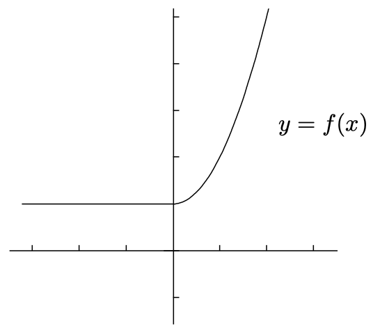

# How to Solve Differentiation Problems

Finding derivatives from the formula is possible but cumbersome, so we'll look at a few rules that make life a lot easier.

## Using the Definition
The basic way to find derivatives is to use its definition:

$$
f'(x) = \lim_{h \to 0} \frac{f(x + h) - f(x)} {h}
$$

so the derivative of $f(x) = \frac{1}{x}$ is:

$$
\begin{align}
f'(x) 
&= \lim_{h \to 0} \frac {\frac{1}{x + h} - \frac{1}{x}} {h} \\
&= \lim_{h \to 0} \frac{\frac{x - (x + h)}{x(x + h)}} {h} \\
&= \lim_{h \to 0} \frac{-h} {hx(x + h)} \\
&= \lim_{h \to 0} \frac{-1} {x(x + h)} \\
&= -\frac{1}{x^2}
\end{align}
$$

In fact, if we replace $x^n$ to $x$ to get $f(x) = x^n$ we can get more general equation:

$$
\begin{align}
f'(x) 
&= \lim_{h \to 0} \frac{f(x + h) - f(x)} {h} \\
&= \lim_{h \to 0} \frac{(x + h)^n - x^n} {h} \\
&= \lim_{h \to 0} \frac{x^n + nhx^{n - 1} + h^2 \times (something...) - x^n} {h} \\
&= \lim_{h \to 0} \frac{nhx^{n - 1} + h^2 \times (something...)} {h} \\
&= \lim_{h \to 0} (nx^{n - 1} + h \times (something...)) \\
&= nx^{n - 1}
\end{align}
$$

## Using rules

Let's define a function $f$ as following:

$$
f(x) = \frac{3x^7 + x^4\sqrt{2x^5 + 14x^{\frac{4}{3}} - 23x + 9}} {6x^2 - 4}
$$

The key to differentiating a function is to understand how it is synthesized from simpler functions. Here are some rules we can use.

### Constant multiples of functions
You just multiply by the constant after your differentiate.

$$
(nf(x))' = nf'(x)
$$

### Sums and differences of functions
You just differentiate each piece and then add or subtract.

$$
(f(x) + g(x))' = f'(x) + g'(x)
$$

### Products of functions via product rule
To solve the problems involving products of functions, you have to mix and match. That is the product rule(**version 1**):

$$
(f(x)g(x))' = f'(x)g(x) + f(x)g'(x)
$$

If we replace $f(x)$ with $u$ and $g(x)$ with $v$, we got(**version 2**);

$$
\frac{dy} {dx} = v\frac{du}{dx} + u\frac{dv}{dx}
$$

What if you have a product of three terms? We have the product rule for three terms(**three variable**):

$$
\frac{duvw} {dx} = \frac{du}{dx}vw + u\frac{dv}{dx}w + uv\frac{dw}{dx}
$$

### Quotients of functions via the quotient rule

Quotients are handled in a way similar to products, except that the rule is a little different. The form of quotients is $h(x) = \frac{f(x)}{g(x)}$, here is the quotient rule(**version 1**):

$$
(\frac{f(x)} {g(x)})' = \frac{f'(x)g(x) - f(x)g'(x)} {(g(x))^2}
$$

There is also another version(**version 2**):

$$
\frac{d}{dx}(\frac{u}{v}) = \frac{v\frac{du}{x} - u\frac{dv}{dx}} {v^2}
$$

### Composition of functions via the chain rule

The Chain rule is discrebed as(**version 1**):

$$
(f(g(x)))' = f'(g(x))g'(x)
$$

And replace $f$ and $g$ with $y$ and $u$, we can invoke the other version of the chain rule(**version 2**):

$$
\frac{dy}{dx} = \frac{dy}{du}\frac{du}{dx}
$$

## Derivatives of Piecewise-Defined Functions

Consider the following piecewise-defined function:

$$
f(x) =
\begin{cases}
1, &if \quad x \le 0, \\
x^2 + 1, &if \quad x > 0. \\
\end{cases}
$$

To check that a piecewise-defined function is differentiable at a point where the pieces join together, you need to check:

- pieces agree at the join point(for continuity);
- the derivatives of the pieces agree at the join point.

Otherwise it's not differentiable at the join point.

