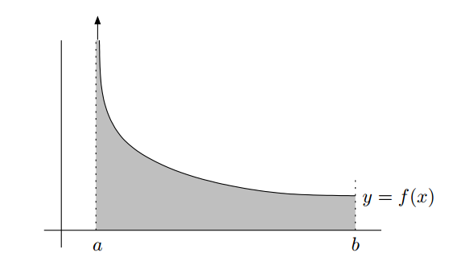

# Improper Integrals

The integral $\int_{a}^{b} f(x) dx$ is **improper** if any of the following conditions apply:

1. $f$ isn't bounded in the closed interval $[a, b]$;
2. $b = \infty$;
3. $a = -\infty$.

If $f(x)$ is unbounded for $x$ near some number $c$, we'll say that $f$ has a *blow-up point* at $x = c$.

We can define the integral of improper integral if we have a blow-up point at $x = a$:

$$
\int_{a}^{b} f(x) dx = \lim_{\epsilon \to 0^+} \int_{a + \epsilon}^{b} f(x) dx
$$

If the limit is $L$ as $\epsilon \to 0^+$, we say that $\int_{a}^{b} f(x) dx$ **converge to L**. If there's no limit, we say that the above integral **diverges**.
