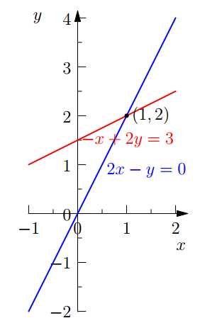

# The Geometry of Linear Equations

The fundamental problem of *n* linear equations in *n* unknowns, for example:

$$
\begin{align}
2x - y = 0 \\
-x + 2y = 3
\end{align}
$$

In this first lecture on linear algebra we view this problem in three ways.

The system above is two dimensional($n = 2$). By adding a third variable *z* we could expand it to three dimensions.

## Row Picture

Plot the points that satisfy each equation. The interaction of the plots(if they do intersect) represents the solution to the system of equations. Looking at the figure below we see that the solution to this system of equations is $x = 1, y = 2$.

We plug this solution into the original system of equations to check our work:

$$
\begin{align}
2 \times 1 - 2 = 0 \\
-1 + 2 \times 2 = 3
\end{align}
$$

The solution to a three dimensional system of equations is the common point of intersection of three planes(if there is one).

## Column Picture
In the column picture we rewrite the system of linear equations as a single equation by turning the coefficients in the columns of the system into vectors.

$$
x \begin{bmatrix} 2 \\ -1 \end{bmatrix} + y \begin{bmatrix} -1 \\ 2 \end{bmatrix} = \begin{bmatrix} 0 \\ 3 \end{bmatrix}
$$

Given two vector $\mathbf{c}$ and $\mathbf{d}$ and scalars $x$ and $y$, the sum $x\mathbf{c} + y\mathbf{d}$ is called a `linear combination` of $\mathbf{c}$ and $\mathbf{d}$. Linear combinations are important throughout this course.

Geometrically, we want to find numbers $x$ and $y$ so that $x$ copies of vector $\begin{bmatrix} 2 \\ -1 \end{bmatrix}$ added to $y$ copies of vector $\begin{bmatrix} -1 \\ 2 \end{bmatrix}$ equals the vector $\begin{bmatrix} 0 \\ 3 \end{bmatrix}$. As we see from the figure below, $x = 1$ and $x = 2$, agreeing with the row picture.

In three dimensions, the column picture requires us to find a linear combination of three 3-dimensional vectors that equals the vector $\mathbf{b}$.

## Matrix Picture

We write the system of equations:

$$
\begin{align}
2x - y = 0 \\
-x + 2y = 3
\end{align}
$$

as a single equation by using matrices and vectors:

$$
\begin{bmatrix} 2 & -1 \\ -1 & 2\end{bmatrix} \begin{bmatrix} x \\ y\end{bmatrix} = \begin{bmatrix} 0 \\ 3\end{bmatrix}
$$

The matrix $A = \begin{bmatrix} 2 & -1 \\ -1 & 2 \end{bmatrix}$ is called the `coefficient matrix`. The vector $x = \begin{bmatrix} x \\ y\end{bmatrix}$ is the vector of unknowns. The values on the right hand side of the equations form the vector $\mathbf{b}$:

$$
A \mathbf{x} = \mathbf{b}
$$

The three dimensional matrix picture is very like the two dimensional one, except that the vectors and matrices increase in size.

### Matrix Multiplication
How do we multiply a matrix $A$ by a vector $\mathbf{x}$?

$$
\begin{bmatrix} 2 & 5 \\ 1 & 3\end{bmatrix} \begin{bmatrix} 1 \\ 2\end{bmatrix} = ?
$$

One method is to think of the entries of $\mathbf{x}$ as the coefficients of a linear combination of the column vectors of the matrix:

$$
\begin{bmatrix} 2 & 5 \\ 1 & 3\end{bmatrix} \begin{bmatrix} 1 \\ 2\end{bmatrix} = 1 \begin{bmatrix} 2 \\ 1 \end{bmatrix} + 2 \begin{bmatrix} 5 \\ 3 \end{bmatrix} = \begin{bmatrix} 12 \\ 7 \end{bmatrix}
$$

This technique shows that $A \mathbf{x}$ is a linear combination of the columns of $A$.

You may also calculate the product $A\mathbf{x}$ by taking the dot product of each row of $A$ with the vector $\mathbf{x}$:

$$
\begin{bmatrix} 2 & 5 \\ 1 & 3\end{bmatrix} \begin{bmatrix} 1 \\ 2\end{bmatrix} = \begin{bmatrix} 2 \cdot 1 + 5 \cdot 2 \\ 1 \cdot 1 + 3 \cdot 2 \end{bmatrix} = \begin{bmatrix} 12 \\ 7 \end{bmatrix}
$$

## Linear Independence
In the column and matrix pictures, the right hand side of the equation is a vector $\mathbf{b}$. Given a matrix $A$, can we solve:

$$
A \mathbf{x} = \mathbf{b}
$$

for every possible vector $\mathbf{b}$? In other words, do the linear combination of the column vectors fill the $xy$-plane(or space, in the three dimensional case)?

If the answer if "no", we say that $A$ is a `singular matrix`. In this singular case its column vectors are `linear dependent`; all linear combinations of those vectors lie on a point or line(in two dimensions) or on a point, line or plane(in three dimensions). The combinations don't fill the whole space.
