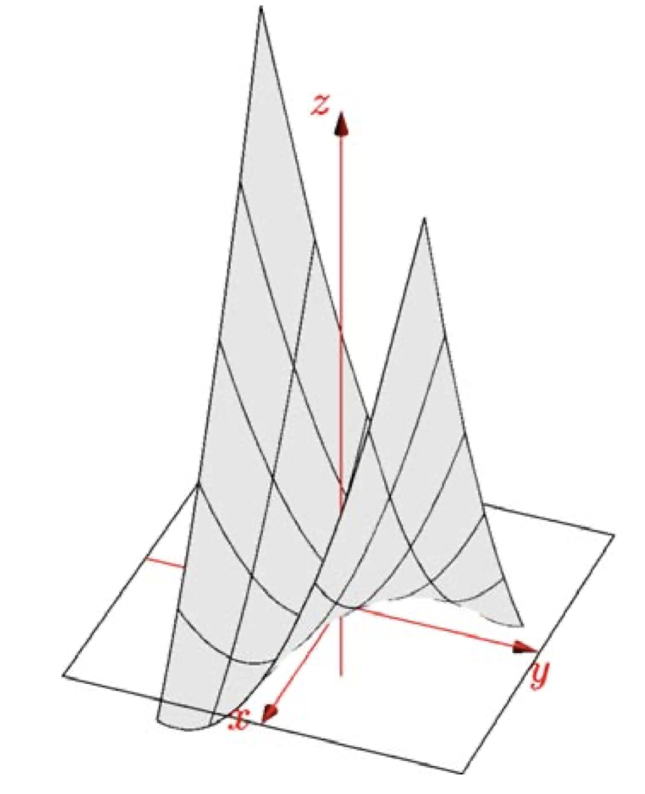
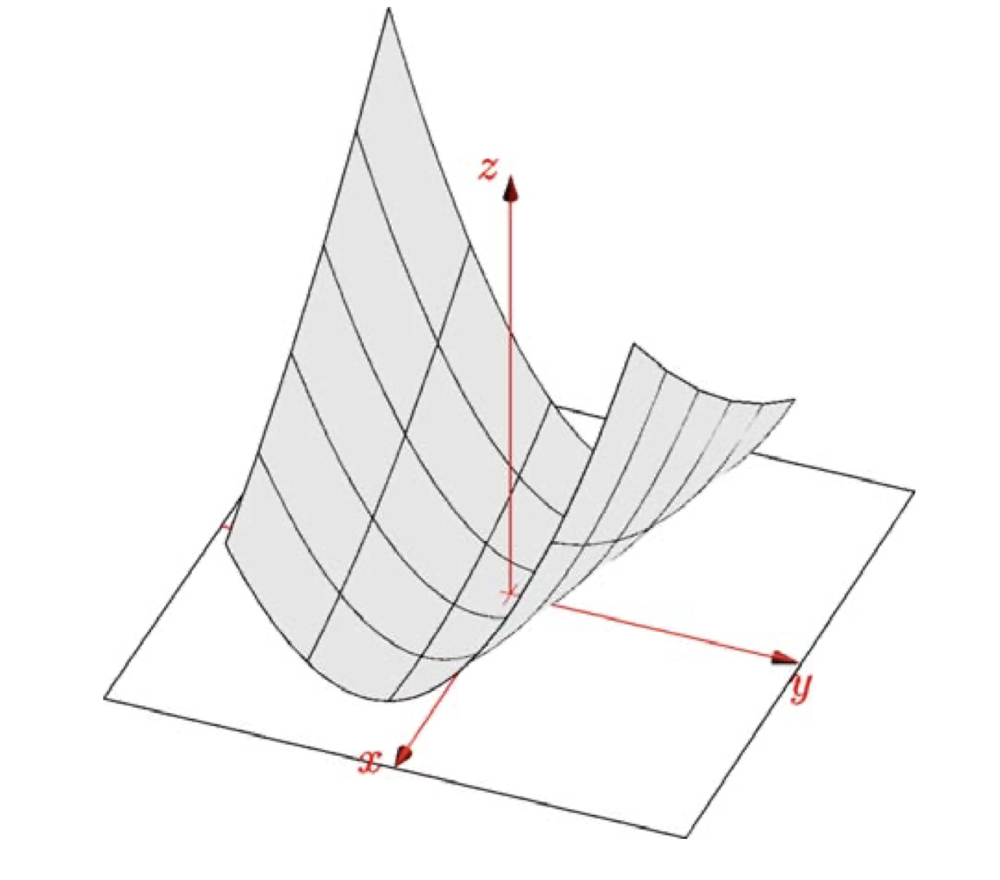

# Positive Definite Matrices and Minima

Studying positive definite matrices brings the whole course together; we use pivots, determinants, eigenvalues and stability. The new quantity here is $\mathbf{x}^T A \mathbf{x}$; watch for it.

This lecture covers how to tell if a matrix is positive definite, what it means for it to be positive definite, and some geometry.

## Positive Definite Matrices

Given a symmetric two by two matrix $\begin{bmatrix}a & b \\ b & c\end{bmatrix}$, here are four ways to tell if it's positive definite:

1. Eigenvalue test: $\lambda_1 > 0, \lambda_2 > 0$
2. Determinants test: $a > 0, ac - b^2 > 0$
3. Pivot test: $a > 0, \frac{ac - b62}{a} > 0$
4. $\mathbf{x}^T A \mathbf{x}$ is positive except when $\mathbf{x} = \mathbf{0}$(this is usually the definition of positive definiteness)

### 2 by 2

Using the determinants test, we know that $\begin{bmatrix}2 & 6 \\ 6 & y \end{bmatrix}$ is positive definite when $2y - 36 > 0$ or when $y > 18$.

The matrix $\begin{bmatrix}2 & 6 \\ 6 & 18 \end{bmatrix}$ is on the borderline of positive definiteness and is called a `positive semidefinite` matrix. It's a singular matrix with eigenvalues 0 and 20. Positive semidefinite matrices have eigenvalues greater than or equal to 0. For a singular matrix, the determinant is 0 and it only has one pivot.

$$
\begin{align}
\mathbf{x}^tA\mathbf{x}
&= \begin{bmatrix}x_1 & x_2\end{bmatrix}\begin{bmatrix}2 & 6 \\ 6 & 18 \end{bmatrix} \begin{bmatrix}x_1 \\ x_2\end{bmatrix} \\
&= \begin{bmatrix}x_1 & x_2\end{bmatrix}\begin{bmatrix}2x_1 + 6x_2 \\ 6x_1 & 18x_2 \end{bmatrix} \\
&= 2x_162 + 12 x_1 x_2 + 18 x_2^2 \\
= ax_1^2 + 2bx_1x_2 + cx_2^2
\end{align}
$$

If this `quadratic form` is positive for every(real) $x_1$ and $x_2$ then the matrix is positive definite. In this positive semi-definite example, $2x_1^2 + 12x_1 x_2 + 18 x_2^2 = 2(x_1 + 3x_2)^2 = 0$ when $x_1 = 3$ and $x_2 = -1$.

## Test for Minimum

If we apply the fourth test to the matrix $\begin{bmatrix}2 & 6 \\ 6 & 7\end{bmatrix}$ which is not positive definite, we get the quadratic form $f(x, y) = 2x^2 + 12xy + 7y^2$. The graph of this function has a saddle point at the origin:

The matrix $\begin{bmatrix}2 & 6 \\ 6 & 20\end{bmatrix}$ is positive definite - its determinant is 4 and its trace is 22 so its eigenvalues are positive. The quadratic form associated with this matrix is $f(x, y) = 2x^2 + 12xy + 20y^2$, which is positive except when $x = y = 0$. The level curve $f(x, y) = k$ of this graph are ellipses; its graph appears in next figure. If $a > 0$ and $c > 0$, the quadratic form $ax^2 + abxy + cy^2$ is only negative when the value of $2bxy$ is negative and overwhelms the (positive) value of $ax^2 + cy^2$.

The first derivatives $f_x$ and $f_y$ of this function are zero, so its graph is tangent to the xy-plane at $(0, 0, 0)$; but this was also true of $2x^2 + 12xy + 7y^2$. as in single variable calculus, we need to look at the second derivatives of $f$ to tell whether there is a minimum at the critical point.

We can prove that $2x^2 + 12xy + 20y^2$ is always positive by writing it as a sum of squares. We do this by completing the square:

$$
2 x^2 + 12xy + 20y^2 = 2(x + 3y)^2 + 2y^2
$$

Note that $2(x + 3y)^2 = 2x^2 + 12xy + 18y^2$, and 18 was the `borderline` between passing and failing the tests for positive definiteness.

When we complete the square for $2x^2 + 12xy + 7y^2$ we get:

$$
2x^2 + 12xy + 7y^2 = 2(x + 3y)^2 - 11y^2
$$

which may be negative; e.g. when $x = -3$ and $y = 1$.

The coefficients that appear when completing the square are exactly the entries that appear when performing elimination on the original matrix. The two pivots are multiplied by the squares, and the coefficient c in the term $(x - cy)^2$ is the multiple of the first row that's subtracted from the second row.

$$
\begin{bmatrix}
2 & 6 \\ 6 & 20
\end{bmatrix}
\xrightarrow{\text{subtract 3 times row 1}} 
\begin{bmatrix}
2 & 6 \\ 0 & 2
\end{bmatrix}
$$

We can see the terms that appear when completing the square in:

$$
U =\begin{bmatrix}2 & 6 \\ 0 & 2\end{bmatrix}
$$

and

$$
L =\begin{bmatrix}1 & 0 \\ 3 & 1\end{bmatrix}
$$

When we complete the square, the numbers multiplied by the squares are the pivots; if the pivots are all positive then the sum of squares will always be positive.

### Hessian Matrix

The matrix of second derivatives of $f(x, y)$ is:

$$
\begin{bmatrix}f_{xx} && f_{xy} \\ f_{yx} & f_{yy}\end{bmatrix}
$$

This matrix is symmetric because $f_{xy} = f_{yx}$. Its determinant is positive when the matrix is positive definite, which matches the $f_{xx}f_{yy} > f_{xy}^2$ test for a minimum that we learned in calculus.

### n by n

A function of several variables $f(x_1, x_2, \cdots, x_n)$ has a minimum when its matrix of second derivatives is positive definite, and identifying minima of functions is often important. The tests we've just learned for 2 by 2 matrices also apply to n by n matrices.

A 3 by 3 example:

$$
A = \begin{bmatrix}2 & -1 & 0 \\ -1 & 2 & -1 \\ 0 & -1 & 2\end{bmatrix}
$$

Is this matrix positive definite? Our tests will say yes. What's the function $\mathbf{x}^TA\mathbf{x}$ associated with this matrix? Does that function have a minimum at $\mathbf{x} =\mathbf{0}$? What does the graph of its quadratic form look like?

Looking at determinants we see:

$$
det[2] = 2, det\begin{bmatrix}2 & -1 \\ -1 & 2\end{bmatrix} = 5, det \begin{bmatrix}2 & -1 & 0 \\ -1 & 2 & -1 \\ 0 & -1 & 2 \end{bmatrix} = 4
$$

These are all positive, so A is positive definite.

The pivots of A are $2, 3/2 $ and $4/3$ (all positive) because the products of the pivots equal the determinants.

The eigenvalues of A are positive and their product is 4. It's not difficullt to check that they are $2 - \sqrt{2}$, 2 and $2 + \sqrt{2}$ (all positive).

## Ellipsoids in R^n

$$
f(x) = \mathbf{x}^T A \mathbf{x} = 2x_1^2 + 2x_2^2 + 2x_3^2 - 2x_1x_2 - 2x_2x_3
$$

Because A is positive definite, we expect $f(x)$ to be positive except when $\mathbf{x} = \mathbf{0}$. Its graph is a sort of four dimensional bowl or `paraboloid`. If we wrote $f(x)$ as a sum of three squres, those squares would be multiplied by the (positive) pivots of A. Earlier, we said that a horizontal slice of our three dimensional bowl shape would be an ellipse. Here, a horizontal slice of the four dimensional bowl is an ellipsoid - a little bit like a rugby ball. For example, if we cat the graph at height 1 we get a surface whose equation is:

$$
2x_1^2 + 2 x_2^2 + 2x_3^2 - 2x_1x_2 - 2x_2x_3 = 1
$$

Just as an ellipse has a major and minor axis, anellipsoid has three axes. If we write $A = Q \Lambda Q^T$, as the principal axis theorem tells us we can, the eigenvectors of A tell us the directions of the principal axes of the ellipsoid. The eigenvalues tell us the lengths of those axiss.
