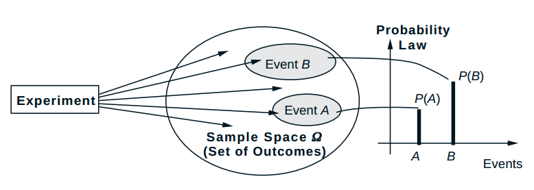

# Sample Space and Probability

The main objective for probability is to develop the art of describing uncertainty in terms of probabilistic models, as well as the skill of probabilitic reasoning.

## Sets

A `set` is a collection of objects, which are the `elements` of sets.

### Set Notes

- If S is a set and x is an element of S, we write $x \in S$;
- If x is not an element of S, we write $x \notin S$;
- A set with no elements called `empty set`, denoted by $\emptyset$;
- If S contains a finite number of elements, we write it as a list of elements in braces:

$$
S = \{ x_1, x_2, \cdots, x_n \}
$$

- If S contains infinitely many elements which can be enumerated in a list, we say S is `countably infinite` and write:

$$
S = \{ x_1, x_2, \cdots \}
$$

- We can alternatively make the set of all x with a certain property P, (the symbol "|" can be read as "such x that satisfy P"):

$$
\{ x | x \text{ statisfies P} \}
$$

- If every element of S is also a an element of T, we say that S is a `subset` of T, denoted as $S \subset T$ or $T \supset S$;
- If $S \subset T$ and $T \subset S$, the two sets are `equal`, and we write $S = T$;
- It's also expedient to introduce a `universal set`, denoted by $\Omega$, which contains all objects of interest in a particular context.

### Set Operations

- The `Component` of a set S, with respect to the universe $\Omega$ is the set $\{x \in \Omega | x \notin S \}$, denoted by $S^c$. $\Omega^c = \emptyset$;
- The `Union` of two sets S and T is the set of all elements that belong to S or T, denoted as $S \cup T$;
- The `Intersection` of two sets S and T is the set of all elements that belong to both S and T, denoted as $S \cap T$;
- Several sets are said to be `disjoint` if no two of them have a common element;
- A collection of sets is said to be a `partition` of a set S if the sets in the collection are disjoint and their union is S.

Sets and the associated operations are easy to visualize in terms of [Venn diagrams](https://en.wikipedia.org/wiki/Venn_diagram).

### The Algebra of Sets

Set operations have several properties:

- $S \cup T$ = $T \cup S$
- $S \cup (T \cup U)$ = $(S \cup T) \cup S$
- $S \cap (T \cup U) = (S \cap T) \cup (S \cap U)$
- $S \cup (T \cap U) = (S \cup T) \cap (S \cup U)$
- $(S^c)^c = S$
- $S \cap S^c = \emptyset$
- $S \cup \Omega = \Omega$
- $S \cap \Omega = S$

Two particularly useful properties are given by `de MOrgan's laws`:

$$
(\bigcup_n S_n)^c = \bigcap_n S_n^c
$$

$$
(\bigcap_n S_n)^c = \bigcup_n S_n^c
$$

## Probabilistic Models

A probabilistic model is a mathematical description of an uncertain situation. It has two elements:

1. The `sample space` $\Omega$, which is the set of all possible outcomes of an experiment;
2. The `probability law`, which assigns to a set A of possible outcomes(also called an `event`) a nonnegtive number $P(A)$(called the `probability` of A) that encodes our knowledge or belief about the collective `likelihood` of the elements of A.

### Sample Space and Events

Every probabilistic model involves an underlying process, called the `experiment`, which produces exactly **one** out of several possible `outcomes`.  The set of all possible outcomes is called the `sample space` of the experiment denoted by $\Omega$. A subset of the sample space, that is, a collection of possible outcomes, is called `event`.

### Choosing an Apropriate Sample Space
