# Common function and their graphs
A `function` is a rule for transforming an object into another object. The object you start with is called the `input`, and comes from some set called the `domain`. Waht you get back is called the `output`; it comes from some set called the `domain`, and the output's value is within a `range`. A function must assign a unique output for each valid input.

We say that:

- a function $f$ is `even` if $f(-x) = f(x)$ for all $x$ in the domain of $f$; 
- a function $f$ is `odd` if $f(-x) = -f(x)$ for all $x$ in the domain of $f$.

The graph of an even function has mirror symmetry about the y-axis and the graph of an odd function has $180^\circ$ point symmetry about the origin.

Let's look at some common functions and their graphs.

## Linear Functions
Functions of the form $f(x) = mx + b$ are called `linear`. There's a good reason for this: the graph of these functions are lines. The slop of the line is given by $m$, and the y-intercept is equal to $b$. To sketch the graph of a linear function, you only need to identify two points on the graph. Set $x = 0$, you get a point $(0, b)$, and set $y = 0$ you get another point $(-\frac{b}{a}, 0)$. Examples are like this:

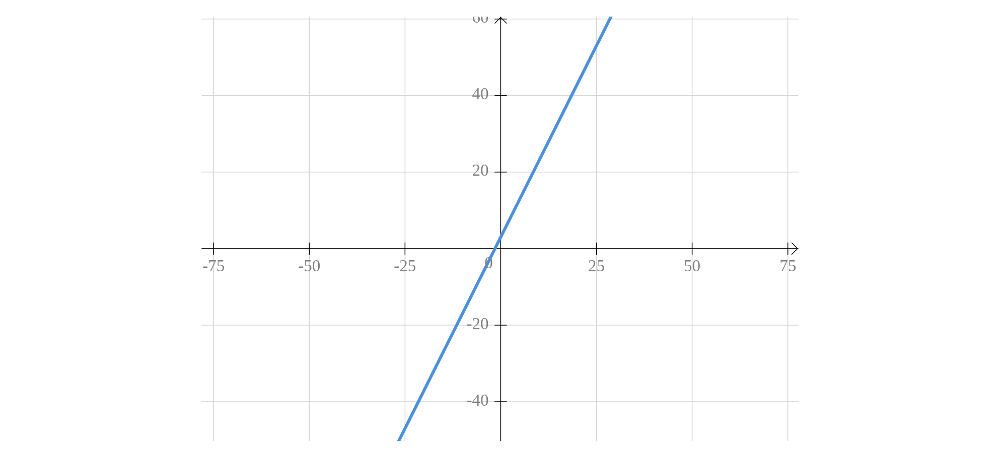

## Polynomials
These are functions built out of nonnegative integer powers of $x$. You start with the building blocks $1$, $x$, $x^2$, $x^3$, and so on, and you are allowed to multiply these basic functions by numbers and add a finite number of them together. The amount that you multiply the building block $x^n$ by is called the `coefficient` of $x^n$. The highest number $n$ such that $x^n$ has a non zero coefficient is called the `degree` of the polynomial. The mathematical way to write a general polynomial of degree $n$ is:
$$
p(x) = a_n x^n + a_{n - 1}x^{n - 1} + ... + a_2x^2 + a_1x + a_0
$$

where $a_n$ is the coefficient of $x^n$, $a_{n - 1}$ is the coefficient of $x^{n - 1}$, ans so on down to $a_0$, which is the coefficient of $1$.

Since the functions $x^n$ are the building blocks of all polynomials, you should know what their graphs look like. The even powers mostly look similar to each other, and the same can be said for the odd powers. Here's what the graphs look like, from $x^0$ up to $x^7$:

![polynomials(images/function_graph/polynomials.png)

Sketching the graphs of more general polynomials is more difficult. Even finding the x-intercepts is often impossible unless the polynomial is very simple. There is one aspect of the graph that is fairly straightforward, which is what happens at the far left and right sides of the graph. This is determined by the so-called `leading coefficient`, which is the coefficient of the highest-degree term.In fact, it only matters whether the leading coefficient is positive or negative. It also matters whether the degree of the polynomial is odd or even; so there are four possibilities for what the edges of the graph can look like:

## Rational functions
The functions with the form:
$$
f(x) = \frac{p(x)}{q(x)}
$$

are called `Rational functions`, where `p` and `q` are polynomials.
Rational functions will pop up in many different contexts, and the graphs can look really different depending on the polynomials `p` and `q`. The simplest examples of rational functions are polynomials themselves, which arise when `q(x)` is the constant polynomial $1$. The next simplest examples are the functions $\frac{1}{x^n}$, where $n$ is a positive integer. Let's look at some of the graph of these functions:

The odd powers look similar to each other, and the even powers look similar to each other too. 

## Exponential functions
Functions with the form:
$$
f(x) = a \cdot b^x
$$

are called `Exponential functions`, where $a$ is a coefficient, $b$ is a positive real number, and $x$ occurs as an `exponent`.
The graph of $f(x) = b^x$ for any other base $b > 0$ looks similar to this:
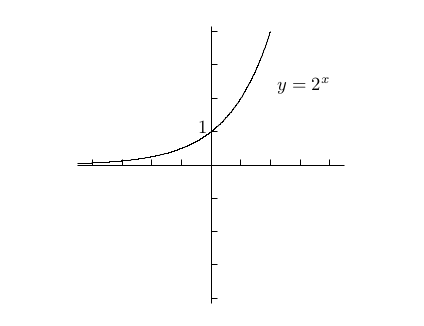

and the graph of $f(x) = b^{-x}$ is just the reflection of $f(x) = b^{x}$ in `y-axis`.
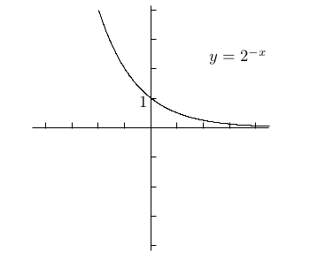

If $a$ is negtive, the graph will be the reflection of its positive one.

## Logarithm functions
When a functions has the form:
$$
f(x) = a \cdot \log_b(x)
$$
we called it a `logarithm function`.
Logarithm functions are the inverse functions of the exponential functions. Using the line $y = x$ as a mirror, the graph of $y = \log_{2}(x)$ looks like this:
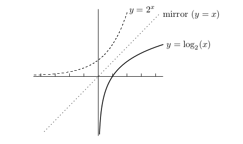

## Trig functions

### Definitions

#### Radians
The first thing we need to know is the notion of `radian`. Instead of saying that there are 360 degrees in a full revolution, we'll say that there are $2\pi radians$. The arc length of a wedge of the circle is the angle of the wedge:

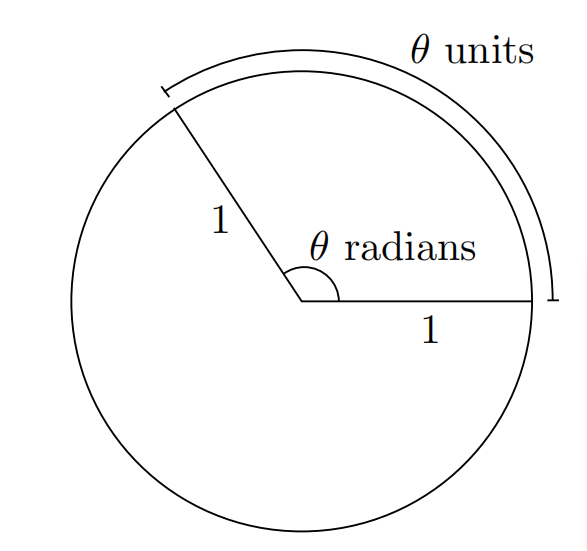

#### Trigonometry Functions
Suppose you have a right-angled triangle and one of the angles, other than the right angle, is labeled $\theta$, like this:

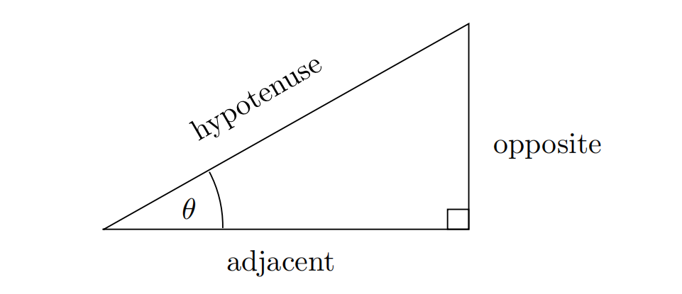

the formulas are defined:
$$
\sin(\theta) = \frac{opposite}{hypotenuse}, \cos(\theta) = \frac{adjacent}{hypotenuse}, \tan(\theta) = \frac{opposite}{adjacent}
$$

We'll also be using the reciprocal functions, which are defined as:
$$
\csc(x) = \frac{1}{\sin(x)}, \sec(x) = \frac{1}{\cos(x)}, \cot(x) = \frac{1}{\tan(x)}
$$
### Value of Trigonometry
Now it's time to figure out the value of trig functions.

#### With the Domain of $0 - \frac{\pi}{2}$
It may be really difficult to calculate the value of trig functions with out a calculator, but some common angles's vlaue you must keep in mind:

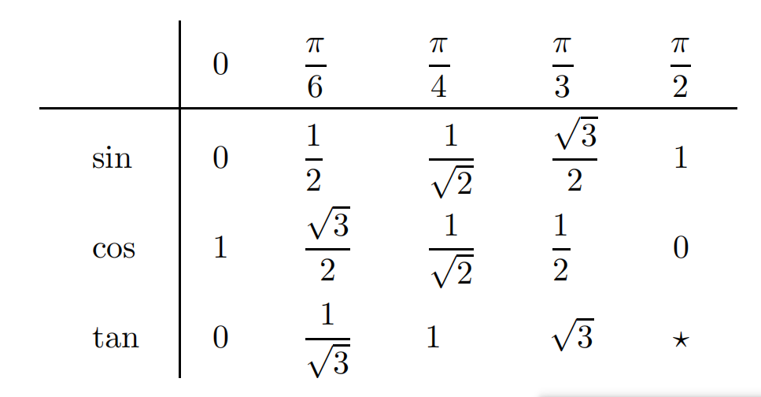

#### With the Domain of $0 - 2\pi$
If an angle is bigger than $2\pi$, for example, $\frac{7\pi}{6}$, we can draw it on the coordinate plane:

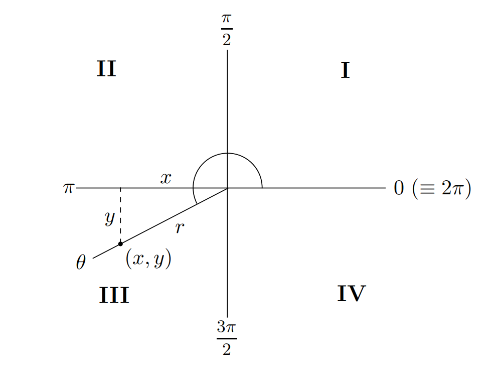

So the angle $7\pi/6$ is in the third quadrant. We've chosen the point on the ray which has distance $r = 1$ from the origin, then dropped a perpendicular. The angle between the ray and the $-\pi$ axis is $\pi / 6$, and we already know that $\sin(\theta) = \frac{y}{1}$, $y < 0$, so we got:

$$
\sin(\frac{7\pi}{6}) = -\sin(\frac{\pi}{6}) = -\frac{1}{2}
$$

The key in the previous example is that $\sin(\frac{7\pi}{6})$ is related to $\sin(\frac{\pi}{6})$, where $\frac{\pi}{6}$ is the reference angle for $\frac{7\pi}{6}$. It's not difficult to find that the trig functions of any anlge is puls or minus value of the reference angle. This can be described as the `ASTC Method`:

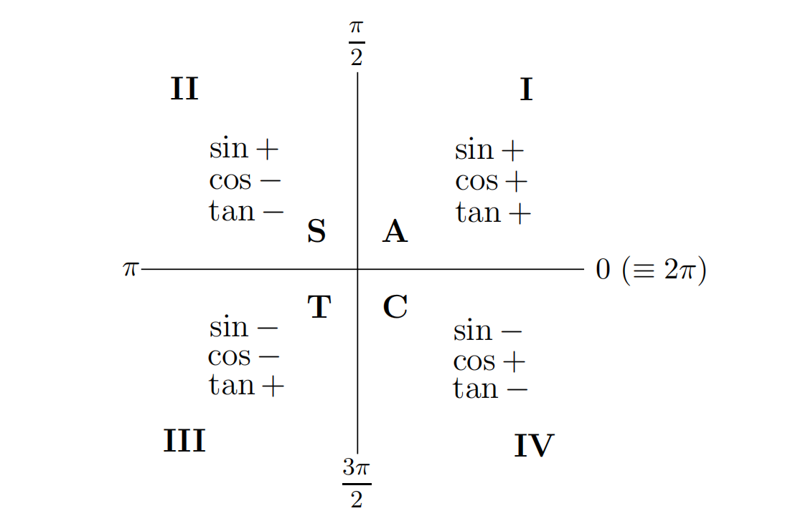

The letters `ASTC` on the diagram are all you need to remember. `A` stands for `All`, meaning all the functions are positive in the first quadrant; the other letters obviously stand for sin, tan, and cos, respectively.

#### With the Domain outside $0 - 2\pi$
If the angle is bigger than $2\pi$ or less than $0$, we can simple add or subtract multiples of $2\pi$ until you get between $0$ and $2\pi$

### Graphs

It's really useful to remember what the graphs of the sin, cos, and tan functions look like. These functions are all `periodic`, meaning that they repeat themselves over and over again from left to right:

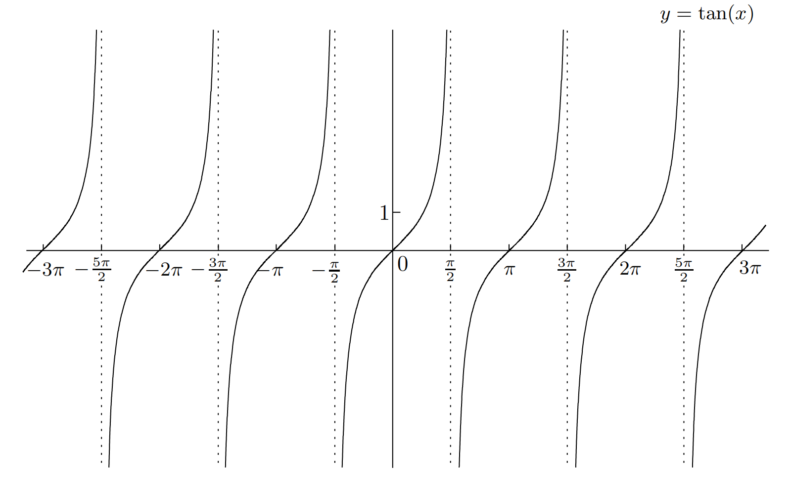

It's also worthwhile learning the graph of $y = \sec(x)$, $y = \sec(x)$, and $y = \cot(x)$:

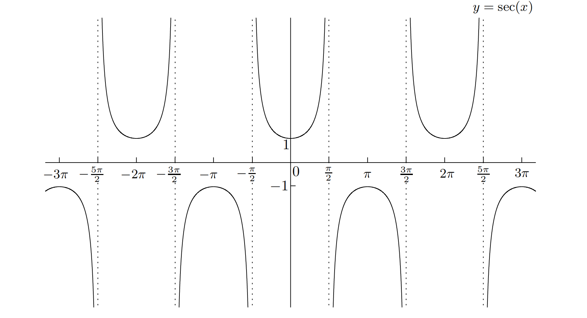
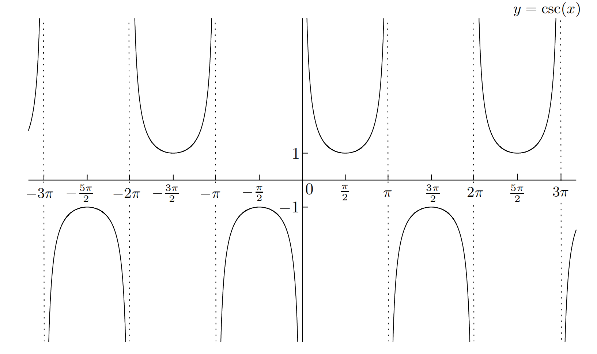
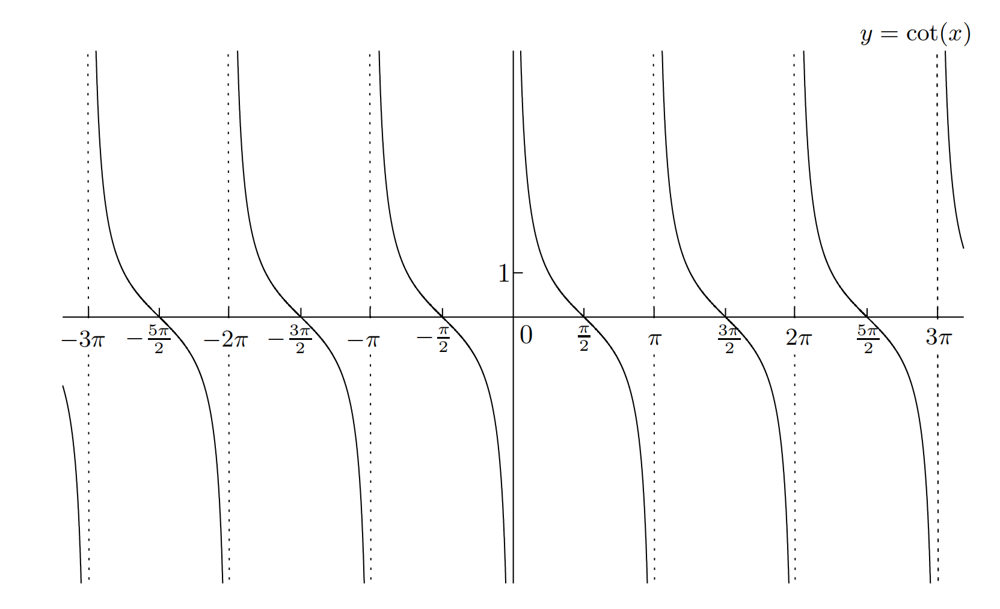

From their graphs, we can get the following symmetry properties:
> $\sin(x)$, $\tan(x)$, $\cot(x)$, and $csc(x)$ are odd functions of $x$.
> $\cot(x)$ and $\sec(x)$ are even functions of $x$.

### Identities

There are relations between trig functions which will come in handy. 

#### $tan$ and $cot$
First, tan and cot may be expressed in terms of sin and cos as follows:
$$
\tan(x) = \frac{\sin(x)}{\cos(x)}, \cot(x) = \frac{\cos(x)}{\sin(x)}
$$

#### Pythagoras' Theorem
The most important of all the trig identities is `Pythagoras' Theorem`:

$$
\cos^2(x) + \sin^2(x) = 1
$$

Now divide this equation by $\cos^2(x)$, we got:
$$
1 + \tan^2(x) = \sec^2(x)
$$

If you dived the `Pythagorean equation` above by $\sin^2(x)$, you got:
$$
\cot^2(x) + 1 = \csc^2(x)
$$

#### trig functions and co-trig functions
There are some more relationships between trig functions. Have you noticed that some of the names begin with the syllable `co`? This is short for the word `complementary`. The fact is that we have the following general relationship:
$$
trig functions(x) = co-trig functions(\frac{\pi}{2} - x)
$$

So in particular, we have

$$
\sin(x) = \cos(\frac{\pi}{2} - x), \tan(x) = \cot(\frac{\pi}{x} - x), \sec(x) = \csc(\frac{\pi}{2} - x)
$$

It even works when the trig function is already a `co`:

$$
\cos(x) = \sin(\frac{\pi}{2} - x), \cot(x) = \tan(\frac{\pi}{2} - x), \csc(x) = \sec(\frac{\pi}{2} - x)
$$

#### Sums of Angles
Specifically, you should remember that:
$$
\sin(A + B) = \sin(A)\cos(B) + \cos(A)\sin(B)
$$
$$
\cos(A + B) = \cos(A)\cos(B) - \sin(A)\sin(B)
$$

It's useful to remember that you can switch all the plues and minues to get some related formulas:
$$
\sin(A - B) = \sin(A)\cos(B) - \cos(A)\sin(B)
$$
$$
\cos(A - B) = \cos(A)\cos(B) + \sin(A)\sin(B)
$$

And if $A = B$, we got:
$$
\sin(2x) = 2\sin(x)\cos(x)
$$
$$
\cos(2x) = 2\cos^2(x) - 1 = 1 - 2\sin^2(x)
$$

## Reference
[The Calculus Life Saver](http://www.astronomia.edu.uy/progs/calculo/The_Calculus_Lifesaver.pdf)
