# Sample-based Path Finding

Sampling-based planner has following features:

- Do not attempt to explicitly construct the C-space and its boundaries
- Simply need to know if a single robot configuration is in collision
- Exploits simple tests for collision with full knowledge of the space
- Collision detection is a separate module, and can be tailored to the application
- As collision detection improves, so do these algorithms
- Different approaches for single-query and multi-query requests

Some notions of completeness in planning:

- `Complete Planner`: always answers a path planning query correctly in bounded time
- `Probabilistic Complete Planner`: if a solution exists, planner will eventrually find it, using random sampling(e.g. Monte Carlo sampling)
- `Resolution Complete Planner`: same as above but based on a deterministic sampling(e.g. sampling on a fixed grid)

## Probabilistic Road Map

A `PRM`(Probablistic Road Map) is:

- A graph structure
- Dividing planning into two phases:
    - Learning phase
    - Query phase
- Checking sampled configurations and connections between samples for collision can be done efficiently
- A relatively small number of milestones and local paths are sufficient to capture the connectivity of the free space

### Learning Phase

- Sample N points in C-space
- Delete points that are not collision-free
- Connect to nearest points and get collision-free segments
- Delete segments that are not collision free

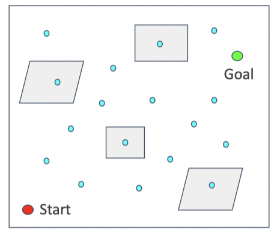
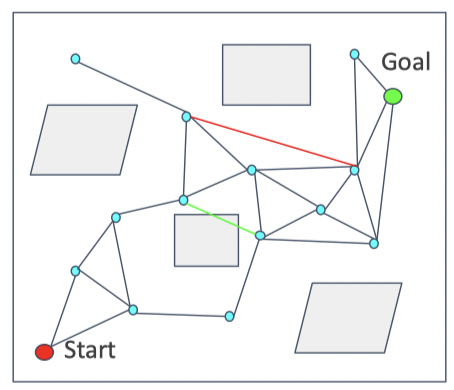

### Query Phase
- Search on the road map to find a path from the start to the goal(using Dijkstra or A star algortihm)
- Road map is now similar with the grid map(or a simplified grid map)
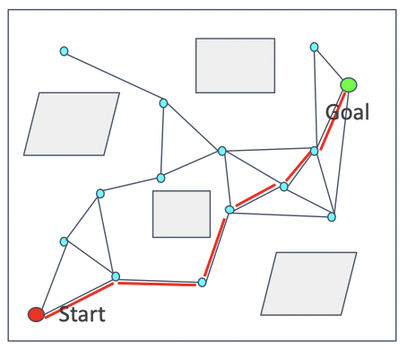

### Pros
- probabilitically complete

### Cons
- Required to solve 2 point boundary value problem
- Build graph over state space but no particular focus on generating a path
- Not efficiet

### Lazy Collision-checking

To improving efficiency of PRM, we can use lazy collision-checking

- Collision-checking process is time-consuming, especially in complex or high-dimensional environments
- Sample points and generate segments without considering the collision(`lazy`)
- Find a path on the road map generated without collision checking
- Delete the corresponding edges and nodes if the path is not collision free
- Restart path-finding

## Rapidly-exploring Random Tree(RRT)

RRT builds up a tree through generating `next states` in the tree by executing random controls.
The algorithm process is:

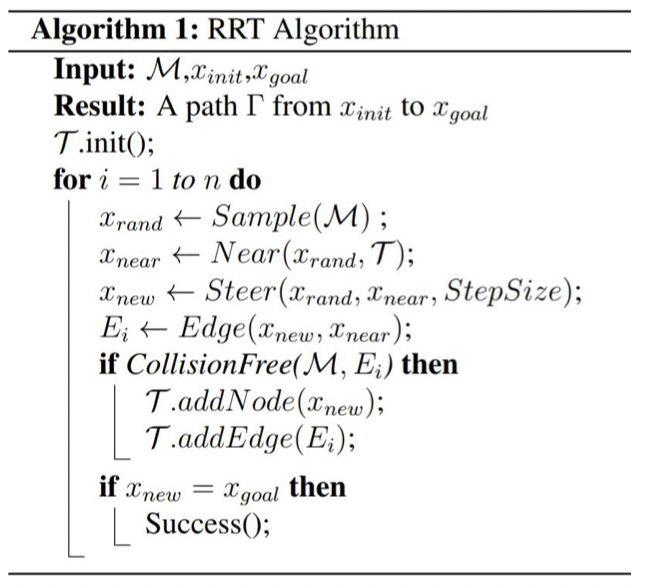

- get a random point from C-space $x_{rand}$
- check the nearest point $x_{near}$ from rrt-tree 
- move from $x_{near}$ to $x_{rand}$ by a distance $step_size$ to get a new point $x_{new}$
- if $x_{new}$ is collision-free, add it to the rrt-tree

### Pros

- Aims to find a path from the start to the goal
- More target-oriented than PRM

### Cons

- Not optimal solution
- Not efficient(leave room for improvement)
- Sample in the whole space

### KD Tree

We can use Kd-tree to accumulate the search nearest point process.

A detail describe can be found [kd-tree](https://blog.csdn.net/junshen1314/article/details/51121582)

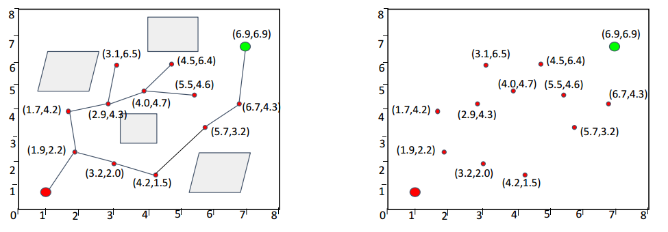
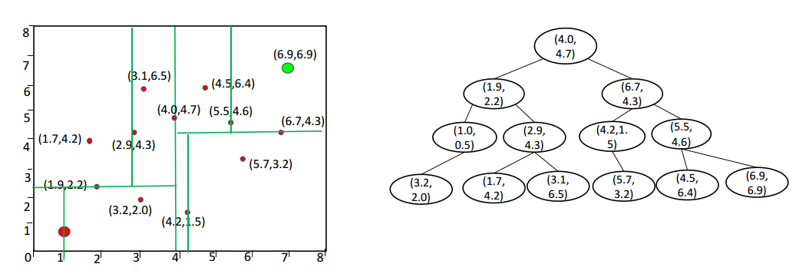

### Bidirectional RRT/RRT Connect

We can also grow the tree from both start point and the goal point, the path would be found when two trees are connected.

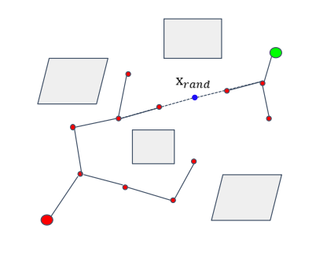

## Optimal Sampling-based Path Planning Methods

### RRT*

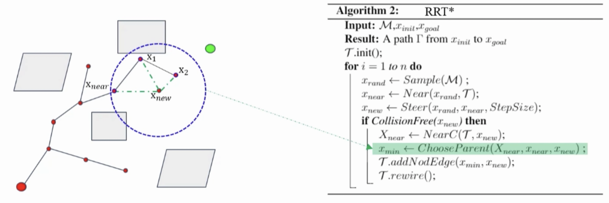

The difference between RRT and RRT star is:

> After adding a new node to RRT tree, RRT\* check all nodes around the new added node.

> If surrounding points can get to start point with lower cost through the new node, they change their parents to the new node. That's the rewire step.

### Kinodynamic-RRT*

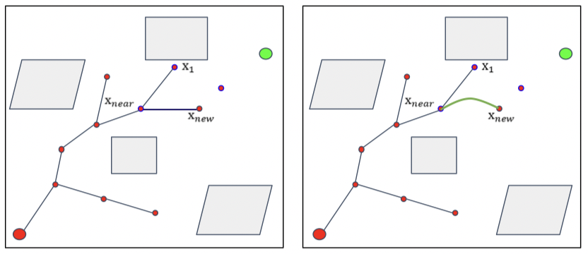

Kinodynamic-RRT\* changes the steer step of RRT\* to fit with motion or other constraints in robot navigation.

- [Kinodynamic RRT\*: Optimal Motion Planning for Systems with Linear Differential Constraints](https://arxiv.org/pdf/1205.5088.pdf)
- [video](https://www.youtube.com/watch?v=RB3g_GP0-dU)

### Anytime RRT\*

Keep optimizing the leaf RRT Tree when the robot executes the current trajectory Anytime Fashion.

- [Anytime Motion Planning using the RRT\*](https://ieeexplore.ieee.org/stamp/stamp.jsp?tp=&arnumber=5980479)

## Advanced Path Planning Methods

### Informed RRT\*

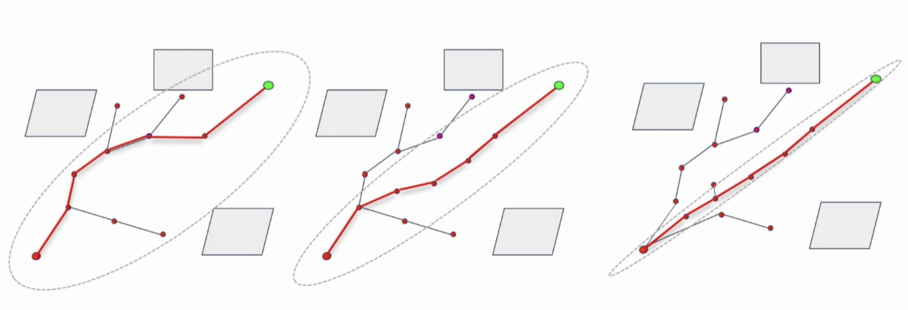

Informed RRT\* makes the RRT tree to grow only in an ellipse, start point and end point are ellipse's two focal points, and the distance from curve to focal points is the length of path. If a new path shorter is found, the distance will decrease. 

- [Informed RRT\*: Optimal sampling-based path planning focused via direct sampling of an admissible ellipsoidal heuristic](Anytime Motion Planning using the RRT*)

### Cross-entropy Motion Planning

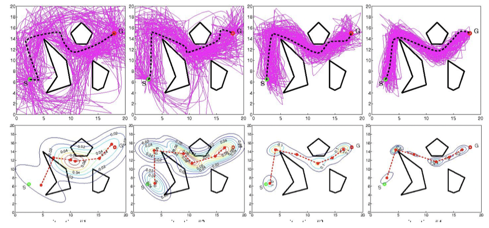

- [Cross-entropy motion planning](www.roboticsproceedings.org/rss07/p22.pdf)

### Other Variants

- Lower Bound Tree RRT
- Sparse Stable RRT
- Transition-based RRT
- Vector Field RRT
- Parallel RRT

### Some Materials

- [An Overview of the Class of Rapidly-Exploring Random Trees](https://dspace.library.uu.nl/bitstream/handle/1874/367745/ICML.pdf?sequence=2&isAllowed=y)
- [RRT](http://lavalle.pl/rrt/)
- [Asymptotically near-optimal RRT for fast, high-quality, motion planning](https://arxiv.org/pdf/1308.0189.pdf)
- [SST software](http://pracsyslab.org/sst_software)
- [Transition-based RRT for Path Planning in Continuous Cost Spaces](homepages.laas.fr/jcortes/Papers/jaillet_aaaiWS08.pdf)
- [VF-RRT: Introducing optimization into randomized motion planning](https://ieeexplore.ieee.org/document/6606360)
- [Parallel Sampling-Based Motion Planning with Superlinear Speedup](https://robotics.cs.unc.edu/publications/Ichnowski2012_IROS.pdf)
- [Charle Wong's Github](https://github.com/zychaoqun)

## Implementation

- [ROS Training](https://industrial-training-master.readthedocs.io/en/melodic/_source/session4/Motion-Planning-CPP.html)
