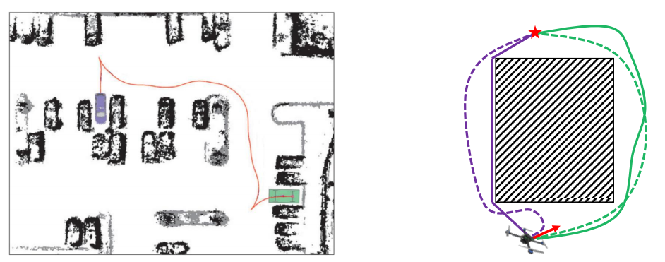
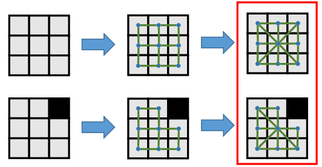
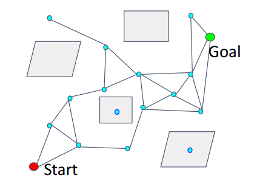
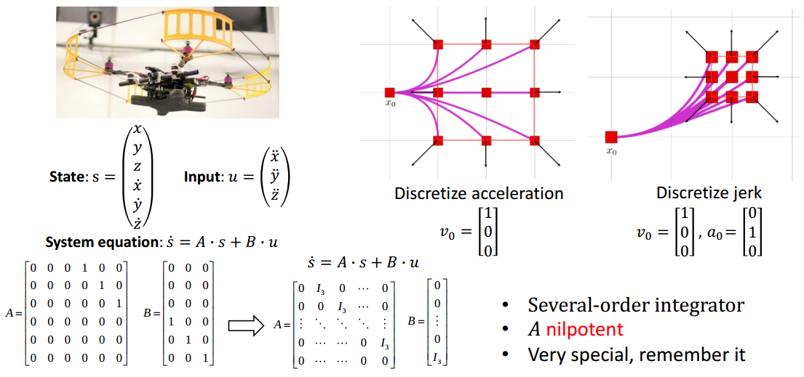
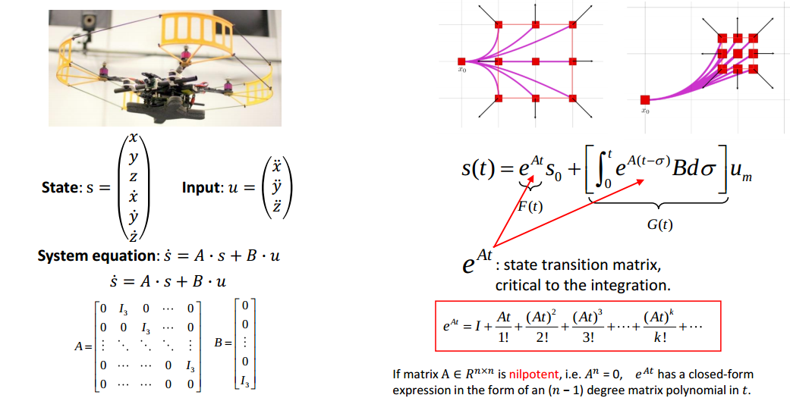
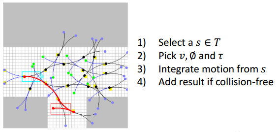
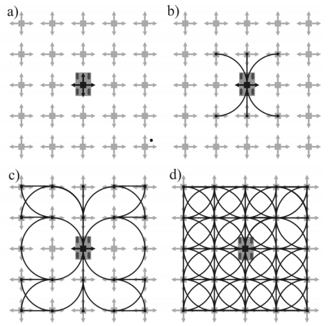
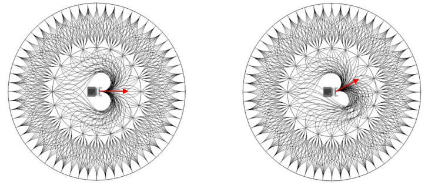
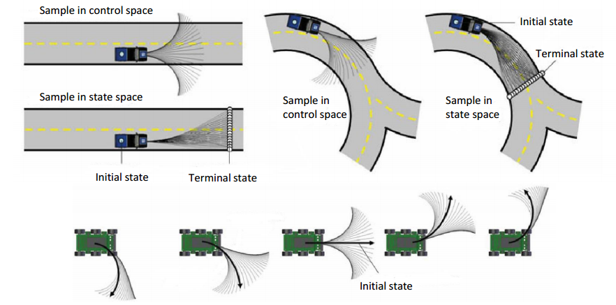
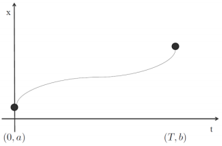

# Kinodynamic Path Finding

## Introduction

The `kinodynamic` planning problem is to synthesize a robot subject to simultaneous 

- `kinematic` constraints, such as `avoiding obstacles`
- `dynamic` constraints, such as modulus `bounds on velocity, acceleration, and force`

A kinodynamic solution is a mapping from time to generalized forces or accelerations.

We choose kinodynamic planning because:

- Straight-line connections between pairs of states are typically not valid trajectories due to the system's `differential constraints`.
- The smoother the path we found, the easier we optimize it.
- Coars-to-fine process
- Trajectory only optimizes locally
- Infeasible path means nothing to nonholonomic system

The typical models we used are:

- [Unicycle model](http://planning.cs.uiuc.edu/node658.html):

- [Bicycle model](http://planning.cs.uiuc.edu/node659.html):

## State Lattice Planning

As learned in [search-based path finding](01_search.md), we have many weapons to attack graph search. But to assume the robot a mass point is not satisfactory any more, we require a graph with `feasible motion connections` now.

The search-based path finding is actually a discretization of control space with the assumption that the robot can move in 4/8 directions:

And the sample-based path finding is a discretization of state sapce where the state is $\mathbb{R}^2$, only position $(x, y)$ is considered.

We can manually create(build) a graph with all edges executable by robot in two ways:

- forward direction: discrete (sample) in `control` space
- reverse direction: discrete (sample) in `state` space

This is the basic motivation for all kinodynamic planning, and state lattice planning is the most straight-forward one.

### Build the Graph, Sample in Control vs. State Space

For a robot model:

$$
\dot{s} = f(s, u)
$$

- The robot is differentially driven
- We have an inital state $s_0$ of the robot
- We can generate feasible local motions by:
    - Select a $u$, fix a time duration $T$, forward simulate the system(numerical integration)
    - 
    - Select a $s_f$, find the connection (a trajectory) between $s_0$ and $s_f$
    - 

### Sample in Control Space

- [Search-based Motion Planning for Quadrotors using Linear Quadratic Minimum Time Control](https://arxiv.org/abs/1709.05401)

The lattice graph obtained by searching is:

Note that:

- During searching, the graph can be built when necessary.
- Create nodes(state) and edges(motion primitive) when nodes are newly discovered.
- Save computational time/space.

And for vehicle, things are different.

The `state` can be:

$$
s = \begin{bmatrix} x \\ y \\ \theta \end{bmatrix}
$$

`Input`:

$$
u = \begin{bmatrix} v \\ \phi \end{bmatrix}
$$

`System equation`:

$$
\begin{bmatrix} \dot{x} \\ \dot{y} \\ \dot{\theta} \end{bmatrix}
=
\begin{bmatrix} v \cdot cos\theta \\ v \cdot sin\theta \\ \frac{R}{L} \cdot tan\phi \end{bmatrix}
$$

where:

- $\theta$ is heading angle
- $\phi$ is steering angle
- $R$ is steering radius
- $L$ is the length from front to rear axle

For every $s \in T$ from the search tree, we pick a control vector $u$ and integrate the equation over short duration, and finally add collision-free motions to the search tree.

### Sample in State Space

We build a lattice graph with:

- Given an origin
- For 8 neighbor nodes around the origin, feasible paths are found
- Extend outward to 24 neighbos.
- Complete lattice

Following is build with `Reeds-Shepp Car Model`:

- [Generating Near Minimal Spanning Control Sets for Constrained Motion Planning in Discrete State Spaces](http://citeseerx.ist.psu.edu/viewdoc/download?doi=10.1.1.70.686&rep=rep1&type=pdf)

And for two or more layers lattice graph, only first layer is different:

- [Optimal Rough Terrain Trajectory Generation for Wheeled Mobile Robot](http://citeseerx.ist.psu.edu/viewdoc/download?doi=10.1.1.375.9234&rep=rep1&type=pdf)

### Comparison

- Trajectories are denser in the direction of the initial angular velocity
- Very similar outputs for several distinct inputs

- [State Space Sampling of Feasible Motions for High-Performance Mobile Robot Navigation in Complex Environments](https://www.ri.cmu.edu/pub_files/pub4/howard_thomas_2008_1/howard_thomas_2008_1.pdf)

## Boundary Value Problem(BVP)

Boundary Value Problem is the basis of state sampled lattice planning. It has no general solution, we have to design case by case. It often envolves complicated numerical optimization.

The basic problem is to design a trajectory (in x direction, for example) such that:

- $x(0) = a$
- $x(T) = b$

We can take the trajecotry $5^{th}$ order polynomial trajectory:

$$
x(t) = c_{5}t^{5} + c_{4}t^{4} + c_{3}t^{3} + c_{2}t^{2} + c_{1}t + c_{0}
$$

The boundary condition will be:

|  | Position | Velocity | Acceleration |
| --- | --- | --- | --- |
| t = 0 | a | 0 | 0 |
| t = T | b | 0 | 0 |

The problem will be solved with:

$$
\begin{bmatrix}
a \\ b \\ 0 \\ 0 \\ 0 \\ 0
\end{bmatrix}
=
\begin{bmatrix}
0 & 0 & 0 & 0 & 0 & 1 \\
T^5 & T^4 & T^3 & T^2 & T & 1 \\
0 & 0 & 0 & 0 & 1 & 0 \\
5T^4 & 4T^3 & 3T^2 & 2T & 1 & 0 \\
0 & 0 & 0 & 2 & 0 & 0 \\
20T^3 & 12T^2 & 6T & 2 & 0 & 0 \\
\end{bmatrix}
\begin{bmatrix}
c_5 \\ c_4 \\ c_3 \\ c_2 \\ c_1 \\ c_0
\end{bmatrix}
$$

### Optimal Boundary Value Problem(OBVP)

If $T$ is fixed, we can get the unique solution of:

$$
\begin{bmatrix}
c_5 \\ c_4 \\ c_3 \\ c_2 \\ c_1 \\ c_0
\end{bmatrix}
$$

But if $T$ is a variable, we can get not only one solution. This is an optimal boundary value problem.

The general step for this problem is:

1. Modelling
2. Solving with Pontryain's minimum principle

We take the quadratic as an example.

### Fixed Final State

#### 1. Modeling

We define the:

a. Cost Function:

$$
J_{\sum} = \sum_{k=1}^{3}J_{k}, J_{k} = \frac{1}{T} \int_0^T j_{k}^2(t) dt
$$

b. State:

$$
S_{k} = \begin{bmatrix} p_{k} \\ v_{k} \\ a_{k} \end{bmatrix}
$$

c. Input:

$$
u_{k} = j_{k}
$$

d. System Model:

$$
\dot {S_{k}} = f_s(s_k, u_K) = \begin{bmatrix} v_k \\ a_k \\ j_k \end{bmatrix}
$$

e. Start and End State:

$$
S(0) = \begin{bmatrix} p(0) \\ v(0) \\ a(0) \end{bmatrix}
$$

$$
S(f) = \begin{bmatrix} p(f) \\ v(f) \\ a(f) \end{bmatrix}
$$

The $k$ in equation is the dimension(x, y, z) of state, and we assume that three dimensions are independent, so we throw away the $k$ in the following equations.

And we also define that the quadratic must arrive the final position with the state of $S(f)$, which causes some difference with undefined dimensions' case, we'll discuss this condition later.

- [A Computationally Efficient Motion Primitive for Quadrocopter Trajectory Generation](https://ieeexplore.ieee.org/document/7299672)
- [Dynamic Programming and Optimal Control](http://www.athenasc.com/dpbook.html)

#### 2. Solving

By `Pontryain's minimum principle`, we first inctroduce the `costate`:

$$
\lambda = \begin{bmatrix} \lambda_1 \\ \lambda_2 \\ \lambda_3 \end{bmatrix}
$$

And define the `Hamiltonian function`:

$$
\begin{align}
H(s, u, \lambda) &= \frac{1}{T} j^2 + \lambda^T f_s(s, u) \\
                 &= \frac{1}{T} j^2 + \lambda_1v + \lambda_2a + \lambda_3j \\
\end{align}
$$

The `Pontryain's minimum principle` says:

$$
\dot {S}^*(t) = f(S^*(t), u^*(t)) 
$$

with $S^*(0) = S(0)$, where:

- `*`, means the optimal value.

And $\lambda(t)$ is the solution of:

$$
\dot{\lambda}(t) = - \Delta H(S^*(t), u^*(t), \lambda(t))
$$

with the boundary condition of:

$$
\lambda(T) = - \Delta(S^*(T))
$$

and the optimal control input is:

$$
u^*(t) = arg \min_{u(t)} H(S^*(t), u(t), \lambda(t))
$$

## Kinodynamic RRT*

## Hybrid A*

