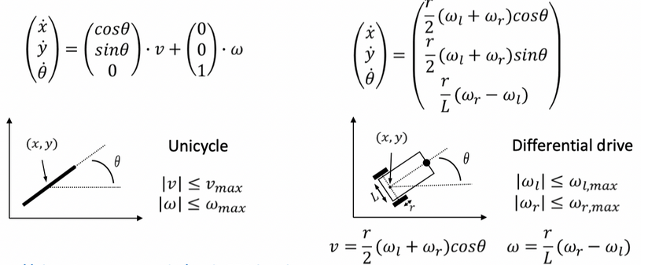
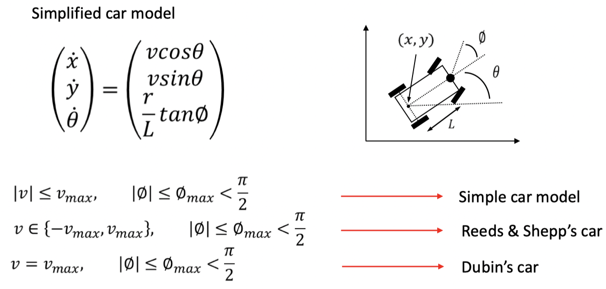

# Kinodynamic

## Introduction
The `kinodynamic` planning problem is to synthesize a robot subject to simultaneous 
- `kinematic` constraints, such as `avoiding obstacles`
- `dynamic` constraints, such as modulus `bounds on velocity, acceleration, and force`
A kinodynamic solution is a mapping from time to generalized forces or accelerations.

We choose kinodynamic planning because:
- Straight-line connections between pairs of states are typically not valid trajectories due to the system's differential constraints.
- The smoother the path we found, the easier we optimize it.

The typical models we used are:
- Unicycle model:

- Bicycle model:

