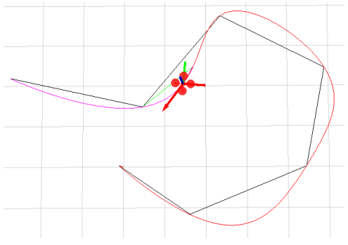
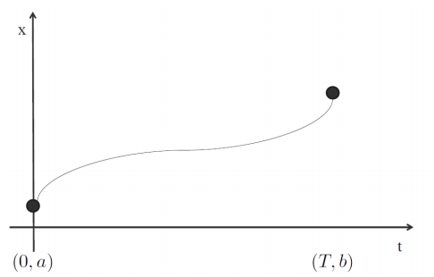
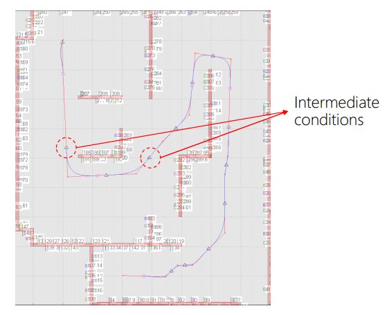

# Minimum Snap Trajectory Generation

## Introduction

### Why Smooth Trajectory?

- Good for autonomous moving
- Velocity/higher-order dynamics can't change immediately
- The robot should not stop at turns
- Save energy

### Smooth Trajectory Generation

There are ways to generate smooth trajectory:

- Boundary condition: start, goal positions(orientations)
- Intermediate condition: waypoint positions(orientations) 
    - Waypoints can be found by path planning (A star, RRT star, etc.)
- Smoothness criteria
    - Generally traslates into minimizing rate of change of "input"

## Minimum Snap Optimization

### Differential Flatness

The states and the inputs of a quadrotor can be written as algebraic functions of four carefully selected flat outputs and their derivatives.

- Enables automated generation of trajectories
- Any smooth trajectory in the space of flat outputs (with reasonably bounded derivatives) can be followed by the under-actuated quadrotor.
- A possible choice: $\sigma = [x, y, z, \psi]^T$
- Trajectory in the space of flat outputs: $\sigma(t) = [T_0, T_M] \to \mathbb{R}^3 \times SO(2)$

Reference:
- [Minimum Snap Trajectory Generation and Control for Quadrotors, Daniel Mellinger and Vijay Kumar](https://ieeexplore.ieee.org/document/5980409)

Polynomial functions can be used to specify trajectories in the space of flat outputs:

- Easy determination of smoothness criterion with polynomial orders.
- Easy and closed form calculation of derivatives.
- Decoupled trajectory generation in three dimensions.

### Mimimum Snap

#### Smooth 1D Trajectory
It's just a simple BVP(Boundary Value Problem).

We design a trajectory $x(t)$ follows boundary condition:

$$
\begin{align}
x(0) = a \\
x(T) = b
\end{align}
$$

So the smoothness ensured by parametrization, we use a $5^{th}$ order polynomial trajectory, this is the smoothness criteria:

$$
x(t) = p_5t^5 + p_4t^4 + p_3t^3 + p_2t^2 + p_1t + p_0
$$

The boundary condition is:

| | Position | Velocity | Acceleration |
| --- | --- | --- | --- |
| t = 0 | a | 0 | 0 |
| t = T | b | 0 | 0 |

It can be solved with:

$$
\begin{bmatrix}
a \\
b \\
0 \\
0 \\
0 \\
0 \\
\end{bmatrix}
=
\begin{bmatrix}
0 & 0 & 0 & 0 & 0 & 1 \\
T^5 & T^4 & T^3 & T^2 & T & 1 \\
0 & 0 & 0 & 0 & 1 & 0 \\
5T^4 & 4T^3 & 3T^2 & 2T & 1 & 0 \\
0 & 0 & 0 & 2 & 0 & 0 \\
20T^3 & 12T^2 & 6T & 2 & 0 & 0 \\
\end{bmatrix}
\begin{bmatrix}
p_5 \\
p_4 \\
p_3 \\
p_2 \\
p_1 \\
p_0 \\
\end{bmatrix}
$$

#### Smooth Multi-Segment Trajectory
If intermediate conditions are given, we get a multi-segment problem. We prefer constant velocity motion at $v$, and zero acceleration.

The boundary conditions become:

| | Position | Velocity | Acceleration |
| --- | --- | --- | --- |
| t = 0 | a | $v_0$ | 0 |
| t = T | b | $v_T$ | 0 |

The solution is:

$$
\begin{bmatrix}
a \\
b \\
v_0 \\
v_T \\
0 \\
0 \\
\end{bmatrix}
=
\begin{bmatrix}
0 & 0 & 0 & 0 & 0 & 1 \\
T^5 & T^4 & T^3 & T^2 & T & 1 \\
0 & 0 & 0 & 0 & 1 & 0 \\
5T^4 & 4T^3 & 3T^2 & 2T & 1 & 0 \\
0 & 0 & 0 & 2 & 0 & 0 \\
20T^3 & 12T^2 & 6T & 2 & 0 & 0 \\
\end{bmatrix}
\begin{bmatrix}
p_5 \\
p_4 \\
p_3 \\
p_2 \\
p_1 \\
p_0 \\
\end{bmatrix}
$$

#### Optimization-based Trajectory Generation
If we know the $v$ and $a$, we can use multi-segment trajec
### Convex Optimization

## Closed-form Solution to Minimum Snap

## Implementation Details
